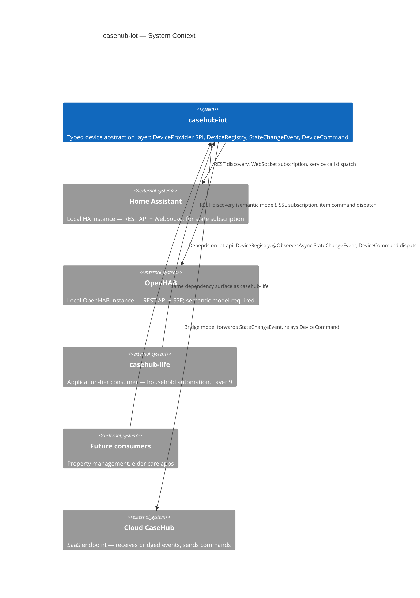
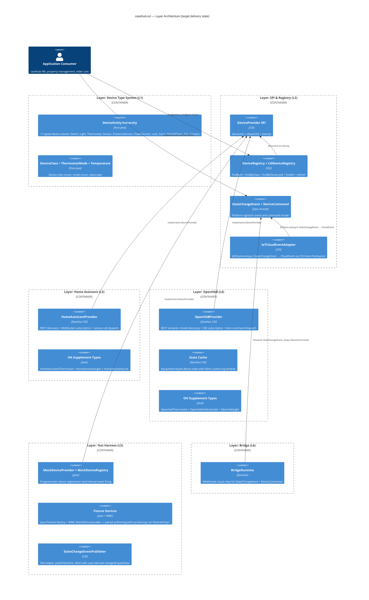
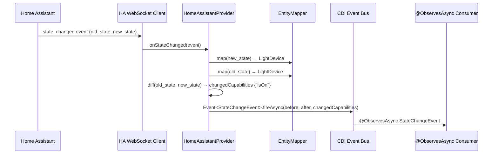
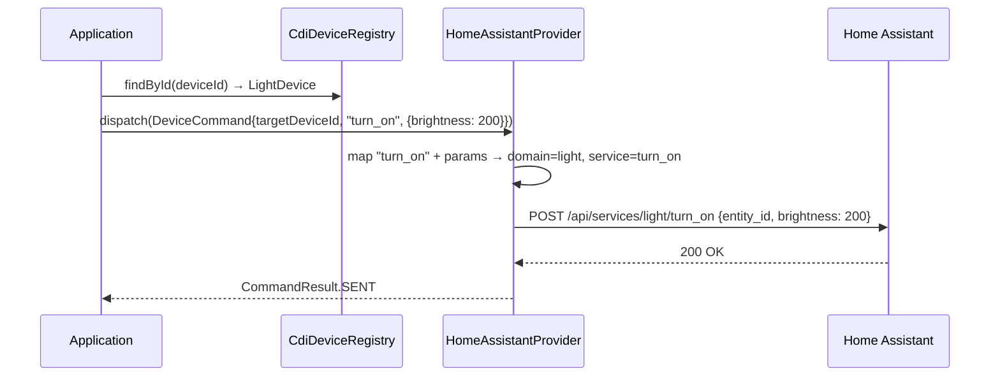
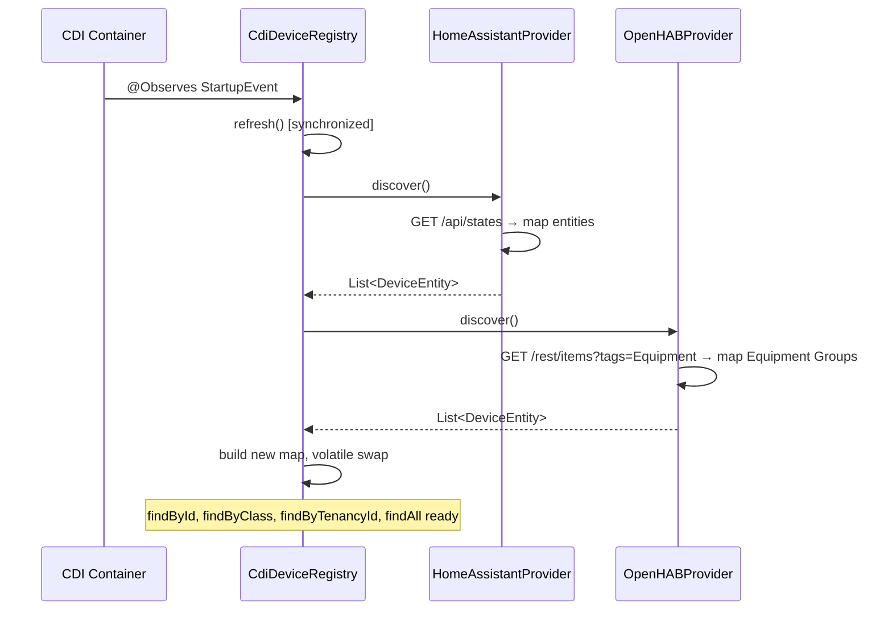
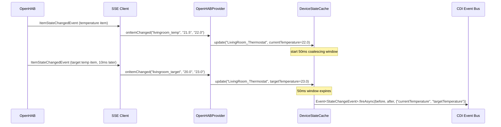
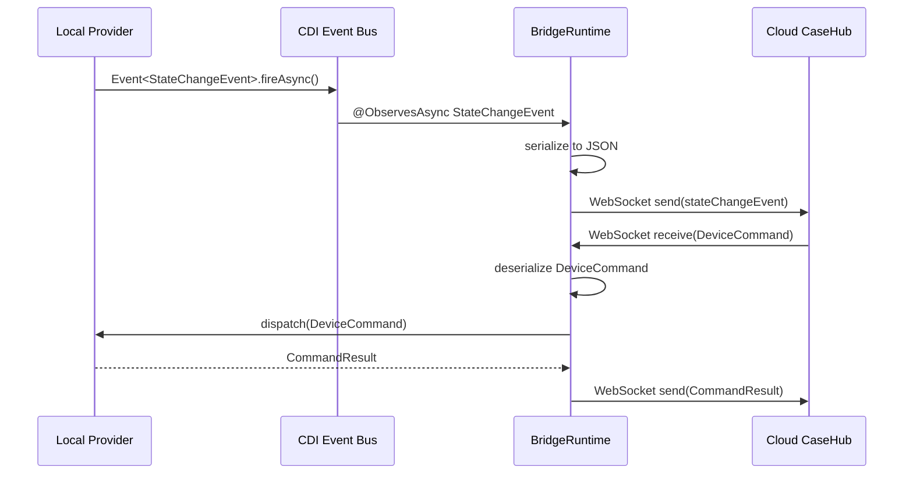
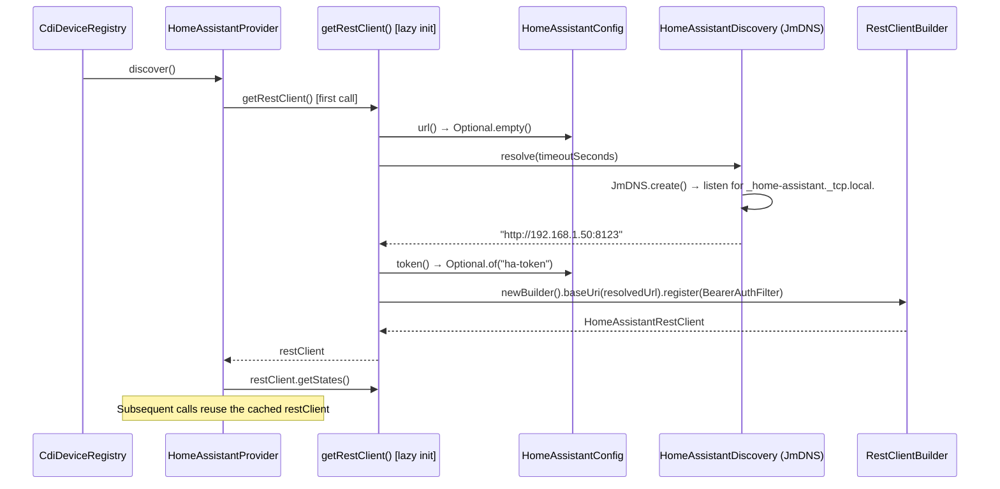
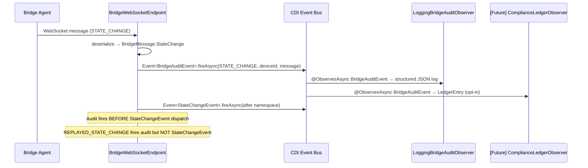
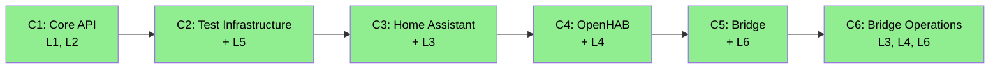

# casehub-iot — ARC42STORIES.MD

**Spec:** Arc42Stories v0.1
**Profile:** CaseHub — Foundation tier
**Profile ref:** `../parent/docs/arc42stories-casehub-profile.md` · fallback: `https://raw.githubusercontent.com/casehubio/parent/main/docs/arc42stories-casehub-profile.md`
**Build position:** Foundation — depends on casehub-platform-api (shared vocabulary)
**Consumed by:** casehub-life (Layer 9), future property management, elder care apps
**Depends on:** casehub-platform-api (types only, no runtime behaviour)
**Prefix:** IOT
**Status:** C1–C6 complete.

---

## §1 Introduction and Goals

### Description

`casehub-iot` is a **foundation IoT device abstraction layer** for the CaseHub ecosystem — peer to `casehub-connectors`. It provides a typed device class hierarchy aligned with the Matter Device Type Library, provider SPIs for platform integration, and platform implementations for Home Assistant and OpenHAB. Consumed by application-tier repos (initially `casehub-life` Layer 9) — never modified by them.

IoT platforms speak different protocols, expose different entity models, and use different state representations. Application code should not know or care which platform is underneath. `casehub-iot` closes that gap: a single `DeviceEntity` hierarchy, a single `StateChangeEvent`, a single `DeviceCommand` — regardless of whether the underlying platform is Home Assistant, OpenHAB, or a future addition.

### Stakeholders

| Stakeholder | Interest |
|---|---|
| casehub-life developers | Primary consumer — Layer 9 home automation; depend on stable iot-api for automation rules |
| Future app-tier consumers | Property management, elder care — need cross-platform device access without vendor lock-in |
| Platform team | Validates foundation correctness under downstream integration requirements |
| Smart home users | Cross-platform device control; automations portable between HA and OpenHAB |

### Quality Goals

| Priority | Goal | Scenario |
|---|---|---|
| 1 | Cross-vendor portability | Automation rule written against iot-api types works identically with HA and OpenHAB — no platform-specific code in consumers |
| 2 | API stability | casehub-life upgrades iot-api minor version; all existing code compiles without changes |
| 3 | Test without hardware | casehub-life runs device-dependent integration tests with MockDeviceProvider and fixture devices; no live HA/OpenHAB needed |
| 4 | Low-latency state propagation | Device state change in HA/OpenHAB surfaces as StateChangeEvent within 100ms on local network |
| 5 | Extensible provider model | New platform (e.g. SmartThings) added by implementing DeviceProvider — no changes to iot-api or existing providers |

### Artifact Schema

PREFIX: `IOT` (issues only — foundation-tier modules use issue refs directly)

| Artifact type | Format | Example | Where it lives |
|---|---|---|---|
| Issue | `#NNN` or `casehubio/iot#NNN` | `#1`, `casehubio/iot#1` | GitHub Issues |
| Garden entry | `GE-YYYYMMDD-XXXXXX` | `GE-20260606-a1b2c3` | `~/.hortora/garden/` |
| Protocol | `PP-YYYYMMDD-XXXXXX` | `PP-20260606-d4e5f6` | `casehub-parent/docs/protocols/` |
| ADR | `ADR-NNNN` | `ADR-0001` | `docs/adr/` |
| Blog entry | `YYYY-MM-DD-[initials]NN-title` | `2026-06-06-mdp01-core-api` | workspace `blog/` |
| Design spec | `YYYY-MM-DD-topic-design` | `2026-06-05-iot-foundation-design` | `docs/superpowers/specs/` |

---

## §2 Constraints

### Platform

| Constraint | Value | Rationale |
|---|---|---|
| Java version | Java 21 | Language features; ecosystem-wide alignment |
| Framework | Quarkus 3.x | CDI, REST client, WebSocket client, SSE |
| Build tool | Maven (system `mvn`, no wrapper) | Ecosystem-wide convention |
| Async model | Reactive SPIs (`Uni<>`) for discover/dispatch | Provider operations perform I/O (REST calls); `Uni<>` return types per `spi-reactive-blocking-io` protocol; corrected from blocking in C3 |
| GroupId | `io.casehub` | Ecosystem-wide; publishes before casehub-life in build order |

### Architectural

- **Public API surface:** `casehub-iot-api` is semver from first release. Community automations in casehub-life depend on it. No breaking changes without a major version bump.
- **Common interface first:** The typed device class hierarchy carries everything with a cross-vendor mapping. Vendor supplement subclasses exist only for genuinely unmappable fields.
- **Matter alignment:** Device class vocabulary aligned with the Matter Device Type Library — industry-standard device categorization.
- **Test-scope only:** `iot-testing` is never a compile or runtime dependency.
- **Bridge is stateless:** `iot-bridge` has no domain logic — pure event forwarding and command relay.
- **Authorization-agnostic:** `iot-api` does not enforce authorization. Application tier (casehub-life) handles permission checks before dispatch.
- **Production-first:** Before writing any class, apply: "Would this class exist in a production system built to this chapter and no further?" If no — do not build it.

### Dependencies

| Dependency | Purpose |
|---|---|
| Quarkus REST client | HA REST API, OpenHAB REST API |
| Quarkus WebSocket Next client | HA WebSocket API (`/api/websocket`) |
| Quarkus REST client reactive | OpenHAB SSE stream |
| Quarkus CDI | Provider discovery via `@Any Instance<DeviceProvider>` |
| Quarkus Jackson | CDI-managed `ObjectMapper` bean for `IoTCloudEventAdapter` JSON serialisation (compile dep on iot-api) |
| CloudEvents SDK (`io.cloudevents:cloudevents-api`) | CloudEvent construction in `IoTCloudEventAdapter` (transitive via `casehub-platform-api`) |

Depends on casehub-platform-api (shared vocabulary + CloudEvents SDK — types only, no runtime behaviour). Foundation-tier peer to `casehub-connectors`.

---

## §3 Context and Scope



### Boundary Rules

**casehub-iot owns:** device type vocabulary (DeviceEntity hierarchy, DeviceClass enum), provider SPI (DeviceProvider, DeviceRegistry), event model (StateChangeEvent, DeviceCommand), platform-specific providers (HA, OpenHAB), vendor supplement types, test infrastructure (MockDeviceProvider, fixtures), bridge runtime (event forwarding, command relay).

**Application tier owns:** authorization and permission checks, household/domain context, automation rules and triggers, device grouping by room/zone/purpose, SLA enforcement on device operations, human-in-the-loop approvals for device commands.

**casehub-iot does NOT own:** user identity, tenancy management (beyond `tenancyId` field on DeviceEntity), platform authentication credential storage, device firmware updates, platform configuration or setup.

---

## §4 Solution Strategy

### Core Architectural Patterns

| Tier | Pattern | IoT expression |
|---|---|---|
| Domain | **Type Hierarchy** | Abstract `DeviceEntity` base with 11 typed subclasses; Matter-aligned vocabulary |
| Integration | **Hexagonal (SPI)** | `DeviceProvider` and `DeviceRegistry` as ports; HA and OpenHAB as adapters |
| Eventing | **CDI async events** | `StateChangeEvent` via `Event.fireAsync()`; consumers use `@ObservesAsync` |
| Discovery | **CDI Instance<>** | Providers are `@ApplicationScoped` beans discovered via `@Any Instance<DeviceProvider>` |
| Mapping | **Strategy** | Platform-specific entity-to-DeviceEntity mappers — one per provider |
| Supplement | **Inheritance** | Vendor-specific fields via subclass extension; consumers downcast only when vendor-aware |

### Layer Taxonomy

| Layer | Concern | Module | Character |
|---|---|---|---|
| L1 | Device Type System | iot-api | Types, enums, value objects + Jackson serialization annotations (`@JsonTypeInfo`, `DeviceTypeIdResolver`). |
| L2 | SPI & Registry | iot-api | CDI contracts (blocking SPIs), @DefaultBean CdiDeviceRegistry, IoTCloudEventAdapter (StateChangeEvent → CloudEvent) |
| L3 | Home Assistant | iot-homeassistant | REST + WebSocket provider + supplement types |
| L4 | OpenHAB | iot-openhab | REST + SSE + semantic model + state cache + supplement types |
| L5 | Test Harness | iot-testing | Mock provider, fixture devices (Java `Fixtures` + YAML `DeviceFixtureLoader`), `DeviceTypeHandler` SPI, event publisher |
| L6 | Bridge | iot-bridge + iot-bridge-server | Two-sided tunnel: local agent (event relay, CDI-discovered filter chain) + cloud-side BridgeDeviceProvider. Docker deployment (multi-arch image, Compose). Conditional provider activation via @LookupIfProperty. BridgeAuditEvent CDI events for operational + compliance audit trails. |

L1 and L2 both reside in `iot-api` but represent distinct architectural concerns: L1 is the vocabulary (types, enums, Jackson serialization annotations); L2 introduces CDI, Mutiny, and runtime behavior (the contracts). L1 now includes Jackson `@JsonTypeInfo` and `DeviceTypeIdResolver` — a deliberate boundary change from "zero framework dependency" to support polymorphic serialization across process boundaries. L2 includes `quarkus-jackson` as a compile dependency on iot-api — provides the CDI-managed `ObjectMapper` bean that `IoTCloudEventAdapter` injects for JSON serialisation. L6 spans two modules: `iot-bridge` (standalone Quarkus app for the local agent) and `iot-bridge-server` (library for the cloud-side provider).

### Chapter Sequencing Rationale

- C1 before C2: Core API provides the types and SPIs that test infrastructure implements (hard dependency)
- C2 before C3: MockDeviceProvider validates SPI contract; test infrastructure enables TDD of real providers (hard dependency)
- C3 before C4: HA is simpler (no state cache, no semantic model) — validates SPI against real platform data before tackling OpenHAB's higher complexity (minimal delta)
- C4 after C3: OpenHAB state cache coalescing and semantic model mapping are informed by HA experience (soft ordering)
- C5 after C3/C4: Bridge depends on iot-api + at least one working provider for integration testing (hard dependency)
- C6 after C5: Bridge Operations requires working bridge infrastructure (hard — Docker image builds from bridge module, audit fires from bridge-server endpoints)

---

## §5 Building Block View

### Layer Architecture View

Target delivery state — all layers complete.



### Module Structure

```
casehub-iot/
├── iot-api/              L1 + L2: Core types + SPI (public API, semver)
│   └── src/main/java/io/casehub/iot/
│       ├── api/          L1: DeviceEntity, DeviceClass, typed subclasses, value types
│       │   │             L2: IoTCloudEventAdapter (StateChangeEvent → CloudEvent)
│       │   └── bridge/   Wire protocol: BridgeMessage sealed interface
│       └── spi/          L2: CdiDeviceRegistry, NoOpDeviceRegistry
├── iot-homeassistant/    L3: Home Assistant provider
│   └── src/main/java/io/casehub/iot/homeassistant/
├── iot-openhab/          L4: OpenHAB provider
│   └── src/main/java/io/casehub/iot/openhab/
├── iot-testing/          L5: Test infrastructure (test-scope only)
│   └── src/main/java/io/casehub/iot/testing/
├── iot-bridge/           L6: Bridge local agent
│   └── src/main/java/io/casehub/iot/bridge/
├── iot-bridge-server/    L6: Bridge cloud-side provider
│   └── src/main/java/io/casehub/iot/bridge/server/
└── pom.xml               Parent POM
```

---

## §6 Runtime View

### Scenario 1 — State Change Propagation (Home Assistant)

A light toggled in Home Assistant surfaces as a typed StateChangeEvent to application consumers.



### Scenario 2 — Device Command Dispatch

Application sends a command; provider maps it to the platform-specific API call.



### Scenario 3 — Device Discovery Lifecycle

At startup, CdiDeviceRegistry discovers all providers and populates the device map.



### Scenario 4 — OpenHAB State Cache Coalescing

Multiple item-level events for the same Equipment Group coalesce into one StateChangeEvent.



### Scenario 5 — Bridge Event Forwarding

Bridge observes local events and relays to cloud; cloud commands relayed back.



### Scenario 6 — Provider Auto-Discovery (mDNS/SSDP)

Provider is enabled but no URL is configured. On first `discover()` or `status()` call, lazy init triggers mDNS/SSDP discovery to resolve the platform URL, then creates the REST client programmatically.



OpenHAB follows the same pattern with `ensureSseConnected()` — tries mDNS first (`_openhab-server._tcp.local.`), falls back to SSDP (raw UDP multicast M-SEARCH on `239.255.255.250:1900`). Both providers have empty `@PostConstruct` methods — the implementation spec prescribed eager init, but the implementation chose lazy init to avoid startup races with test servers.

### Scenario 7 — Bridge Audit Event Flow

Bridge server fires `BridgeAuditEvent` for every protocol message. Multiple CDI observers process independently — operational logging always on, compliance ledger opt-in via classpath.



Firing points: `@OnOpen` (AGENT_CONNECTED), `@OnClose` (AGENT_DISCONNECTED), `@OnTextMessage` (STATE_CHANGE, REPLAYED_STATE_CHANGE, STATE_SNAPSHOT, PROVIDER_STATUS_CHANGE, COMMAND_RESPONSE), `BridgeDeviceProvider.dispatch()` (COMMAND_SENT). No HEARTBEAT audit — protocol noise.

---

## §7 Deployment View

### Mode 1 — Local

Provider connects directly to HA/OpenHAB on the same machine or local network. No internet dependency. All processing on-premises.

```
┌──────────────────────────────────┐
│         Local Machine            │
│  ┌──────────┐  ┌──────────────┐  │
│  │ casehub  │──│ iot-api +    │  │
│  │  -life   │  │ iot-ha / oh  │  │
│  └──────────┘  └──────┬───────┘  │
│                       │          │
│              ┌────────▼────────┐ │
│              │ HA / OpenHAB    │ │
│              └─────────────────┘ │
└──────────────────────────────────┘
```

### Mode 2 — Bridge (SaaS)

`iot-bridge` runs locally. Connects to HA/OpenHAB locally. Forwards StateChangeEvents to cloud CaseHub via WebSocket. Relays DeviceCommands back.

```
┌───────────────────┐          ┌──────────────────┐
│   Local Machine   │          │  Cloud CaseHub   │
│ ┌───────────────┐ │   WSS    │ ┌──────────────┐ │
│ │  iot-bridge   │─┼──────────┼─│ casehub-life │ │
│ └───────┬───────┘ │          │ └──────────────┘ │
│         │         │          └──────────────────┘
│ ┌───────▼───────┐ │
│ │ HA / OpenHAB  │ │
│ └───────────────┘ │
└───────────────────┘
```

### Mode 3 — Hybrid

Latency-sensitive observers (Drools rules, YAML triggers) are added to the bridge deployment as classpath dependencies — standard Quarkus CDI extension. They fire locally via `@ObservesAsync StateChangeEvent` on the bridge's own CDI container. The bridge still forwards all events to cloud for orchestration, HITL, ledger, and memory. No bridge-specific configuration — "hybrid" is a deployment topology choice, not a bridge mode.

```
LOCAL:  bridge + iot-ha + life-triggers.jar  →  cloud: bridge-server + casehub-life
```

### Docker Deployment

Image: `ghcr.io/casehubio/iot-bridge` — eclipse-temurin:21-jre-alpine, Quarkus fast-jar layout, non-root user (UID 1001). Multi-arch: ARM64 (Raspberry Pi 4/5) + x86_64 via `docker buildx` in GitHub Actions.

Docker Compose (`bridge/docker-compose.yml`): single service, `network_mode: host` (required for mDNS/SSDP multicast discovery), named volume for persistent event store (`data/bridge-events/`), health check via `/q/health/ready`. Both HA and OpenHAB provider modules are on the classpath — each activates independently.

Deployment guide: `bridge/DEPLOYMENT.md` — prerequisites, configuration reference, deploy/verify/update workflow, troubleshooting.

### Provider Activation

Both provider modules ship in a single Docker image. Activation is controlled by `@LookupIfProperty`:

```java
@ApplicationScoped
@LookupIfProperty(name = "casehub.iot.homeassistant.enabled", stringValue = "true")
public class HomeAssistantProvider implements DeviceProvider { ... }
```

When `enabled` is absent or not equal to `"true"`, the provider bean is not discoverable via `Instance<DeviceProvider>`. `CdiDeviceRegistry` and `BridgeCommandDispatcher` simply don't see it. No `@PostConstruct` runs. No REST client creation. No guard code needed — the provider doesn't exist.

All provider config properties are `Optional<String>` — prevents SmallRye startup validation failure when a provider is disabled but its config properties are absent.

### Build Commands

```bash
mvn --batch-mode install                     # Build all modules
mvn --batch-mode deploy -DskipTests          # Publish to GitHub Packages (CI only)
```

---

## §8 Crosscutting Concepts

### Governing Protocols and References

| Concern | Protocol / Reference |
|---|---|
| Module structure | `docs/protocols/universal/module-tier-structure.md` |
| CDI provider discovery | `@Any Instance<DeviceProvider>` — Quarkus CDI standard |
| Async events | CDI `Event.fireAsync()` / `@ObservesAsync` |
| Device class vocabulary | [Matter Device Type Library](https://csa-iot.org/developer-resource/specifications-download-request/) |
| Vendor supplement pattern | Extends common type only for fields with no cross-vendor equivalent |
| Connection lifecycle | Exponential backoff: base 5s, max 5min, ProviderStatusEvent on transitions |
| CloudEvent adapter | `IoTCloudEventAdapter` — `@ObservesAsync StateChangeEvent` → CloudEvent via `Event.fireAsync()` |

### CloudEvent Adapter Pattern

`IoTCloudEventAdapter` observes every `StateChangeEvent` and re-publishes it as a CloudEvent. Consumers that don't want coupling to iot-api types observe `@ObservesAsync CloudEvent` instead.

- **Type:** `io.casehub.iot.state_change.{deviceClass}` — lowercase device class as suffix
- **Source:** `/casehub-iot`
- **Subject:** `device/{deviceId}`
- **Data:** JSON-serialised `StateChangeEvent` (full before/after with `ObjectMapper`)
- **Extensions:** `providerid`, `tenancyid` (when non-null)

The adapter injects `ObjectMapper` via CDI (`quarkus-jackson` provides the `@ApplicationScoped` bean). Serialisation failures log at WARN and fire with empty data — never block the CDI event pipeline. `fireAsync()` failures are handled via `.exceptionally()`.

This pattern is reusable across CaseHub modules: each domain publishes its own `{domain}.{eventType}.{subType}` CloudEvent type using the same CloudEvents SDK (`io.cloudevents:cloudevents-api` via `casehub-platform-api`).

### Vendor Supplement Pattern

Common device types carry fields mappable from both HA and OpenHAB. Fields with no cross-vendor equivalent belong in vendor supplement subclasses only.

**Test:** "Does this field have a meaningful mapping in both HA and OpenHAB?" If yes → common type. If no → supplement type in the vendor module.

Examples:
- `brightness` → both HA and OpenHAB expose brightness as 0–255. Common type.
- `rgbColor` → HA uses RGB; OpenHAB uses HSB. No common representation. Supplement types: `HomeAssistantLight.rgbColor()`, `OpenHABColorItem.hsb()`.
- `hvacAction` → HA-specific concept ("heating", "cooling", "idle"). No OpenHAB equivalent. Supplement: `HomeAssistantThermostat.hvacAction()`.

### changedCapabilities Population

`StateChangeEvent.changedCapabilities` identifies which device fields changed — consumers pattern-match without full diffing.

- **OpenHAB:** populated directly from the item event — the event names the specific item that changed, and the provider maps item to capability.
- **Home Assistant:** populated by diffing `old_state` and `new_state` attribute maps (HA events include previous state).

This preserves OpenHAB's field-level precision and makes HA produce the same granularity.

### Anti-patterns

**Leaky abstraction — vendor concept in common type**

- **Symptom:** Common `LightDevice` has `rgbColor()`. OpenHAB implementation returns null because OpenHAB uses HSB.
- **Cause:** Field placed in common type without verifying cross-vendor mapping.
- **Fix:** Only fields mappable from both HA and OpenHAB belong in common types. HA RGB → `HomeAssistantLight.rgbColor()`. OpenHAB HSB → `OpenHABColorItem.hsb()`.

**Blocking I/O on CDI event thread**

- **Symptom:** `@ObservesAsync StateChangeEvent` handler performs REST call; other event handlers starve.
- **Cause:** CDI async events share a thread pool. Blocking calls consume pool threads.
- **Fix:** Event handlers delegate I/O to `Uni<>` or a separate executor. Keep event handling non-blocking.

**Stale device from registry after state change**

- **Symptom:** Consumer reads DeviceEntity from registry immediately after receiving StateChangeEvent; gets pre-change state.
- **Cause:** Registry update and event fire are not atomic. Consumer reads between provider receiving platform event and registry update completing.
- **Fix:** CdiDeviceRegistry updates device map before provider fires StateChangeEvent. Consumers should use `event.after()`, not re-read from registry.

**Command dispatch to disconnected provider**

- **Symptom:** DeviceCommand dispatched to DISCONNECTED provider; `Uni` completes with TIMEOUT after delay.
- **Cause:** Application dispatches without checking `ProviderStatus`.
- **Fix:** Provider `dispatch()` returns `CommandResult.FAILED` immediately when status is DISCONNECTED. Application may also pre-check `provider.status()`.

### Provider Activation Pattern

`@LookupIfProperty(name = "casehub.iot.<provider>.enabled", stringValue = "true")` makes provider beans conditionally visible to CDI. When `enabled` is absent or not equal to `"true"`, the bean is not instantiated — no lazy init triggered, no REST client creation, no guard code. All provider consumption goes through `@Any Instance<DeviceProvider>`, which only sees enabled providers.

All provider config properties (`url`, `token`, auth nested objects) are `Optional<String>`. SmallRye Config validates `@ConfigMapping` properties at startup regardless of bean lifecycle — required properties on a disabled provider crash the app before any `@PostConstruct` or `@LookupIfProperty` evaluation occurs.

### TenancyId Consolidation

Single `casehub.iot.tenancy-id` root property (env var `CASEHUB_IOT_TENANCY_ID`) replacing three per-module `tenancyId()` properties on `BridgeAgentConfig`, `HomeAssistantConfig`, `OpenHabConfig`. Every consumer injects via `@ConfigProperty(name = "casehub.iot.tenancy-id")` directly. One property, zero divergence risk.

### Programmatic REST Client Creation

`RestClientBuilder` replacing `@RegisterRestClient` property expressions for both HA and OpenHAB REST clients. Root cause: SmallRye resolves `${casehub.iot.homeassistant.url}` at config startup — before CDI starts, before `@LookupIfProperty` evaluates. Two failure modes:

1. **Disabled provider with absent URL:** `Optional<String>` on the `@ConfigMapping` doesn't help — the property expression in `application.properties` is resolved by SmallRye directly. `NoSuchElementException` crashes the app.
2. **Auto-discovery produces URL after REST client binding:** `@RestClient` base URL is immutable after config time. Discovery in lazy init resolves the URL too late.

Fix: remove property expressions from `application.properties`, create REST clients programmatically in lazy init via `RestClientBuilder.newBuilder().baseUri(resolvedUrl).register(authFilter).build(...)`.

**Gotcha:** `ClientHeadersFactory` (MicroProfile REST Client extension interface) is silently ignored by `RestClientBuilder.register()` — it is not a JAX-RS provider. No error, no auth header, 401 on every request. Auth must use `ClientRequestFilter` (a plain JAX-RS provider) instead. `OpenHabAuthHeadersFactory` was deleted and replaced by `OpenHabAuthFilter implements ClientRequestFilter`.

### Bridge Audit Trail (Dual-Trail Pattern)

`BridgeAuditEvent` CDI event type in `api/bridge/`. `BridgeAuditEventType` enum with 8 event types (no HEARTBEAT — protocol noise, not auditable). Operational observer (`LoggingBridgeAuditObserver`) always active when bridge-server is on the classpath — structured JSON logging queryable via log aggregation.

Compliance observer is opt-in via classpath: a future `casehub-iot-bridge-ledger` module would contain an `@ObservesAsync BridgeAuditEvent` handler writing `BridgeLedgerEntry extends LedgerEntry`. Multiple CDI event observers coexist independently — the original design considered a `BridgeAuditStore` SPI, but CDI selects one SPI implementation (highest priority), while dual-trail requires BOTH operational logging AND compliance ledger active simultaneously.

Structured query and retrieval of audit history (beyond log aggregation) is deferred to #35 (`BridgeAuditStore` SPI).

---

## §9.1 Journey Overview

| Journey | Description | Chapters | Status |
|---|---|---|---|
| IoT Device Abstraction | From bare scaffold to deployable, tested, multi-platform device integration layer | 6 | Complete |



---

## §9.2 Chapter Index

| # | Chapter | Journey | Layers touched | Delta summary | Status |
|---|---|---|---|---|---|
| 1 | Core API | IoT Device Abstraction | L1, L2 | High, High | ✅ |
| 2 | Test Infrastructure | IoT Device Abstraction | + L5 | High | ✅ |
| 3 | Home Assistant | IoT Device Abstraction | + L3 | High | ✅ |
| 4 | OpenHAB | IoT Device Abstraction | + L4 | High | ✅ |
| 5 | Bridge | IoT Device Abstraction | + L6 | High | ✅ |
| 6 | Bridge Operations | IoT Device Abstraction | L3, L4, L6, crosscutting | Low, Low, High | ✅ |

### Layer x Chapter Matrix

| Layer | C1 | C2 | C3 | C4 | C5 | C6 |
|---|---|---|---|---|---|---|
| L1 Device Type System | High | Low | Low | Low | — | — |
| L2 SPI & Registry | High | Low | Low | Low | Low | — |
| L3 Home Assistant | — | — | High | — | Low | Low |
| L4 OpenHAB | — | — | — | High | Low | Low |
| L5 Test Harness | — | High | Low | Low | — | — |
| L6 Bridge | — | — | — | — | High | High |

L1 and L2 appear in C1–C4: foundational — real platform data in C3/C4 may surface type adjustments or SPI refinements. L5 appears in C2–C4: test harness grows as providers add fixtures. L3, L4, L6 are additive single-column entries — stable after introduction.

### Sequencing Rationale

- C1 before C2: Core API provides the types and SPIs that test infrastructure implements (hard — MockDeviceProvider implements DeviceProvider)
- C2 before C3: MockDeviceProvider validates SPI contract; test infrastructure enables TDD of real providers (hard — contract must be validated before real provider work)
- C3 before C4: HA is simpler (no state cache, no semantic model) — validates SPI against real platform data before OpenHAB's higher complexity (minimal delta — one platform concern vs two)
- C4 after C3: OpenHAB state cache coalescing and semantic model mapping informed by HA implementation experience (soft — C4 could technically proceed independently)
- C5 after C3/C4: Bridge requires at least one working provider for integration testing (hard — bridge forwards events from real providers)
- C6 after C5: Bridge Operations requires working bridge infrastructure (hard — Docker image builds from bridge module, audit fires from bridge-server endpoints)

---

## §9.3 Chapter Entries

### Chapter 1 — Core API

**Journey:** IoT Device Abstraction | **Sequence:** 1 of 6 | **Status:** ✅
**Delivered:** 2026-06-07 | **Issues:** #1

**What this delivers**

`iot-api` module — the full public API surface. 11 typed device classes with cross-vendor fields, DeviceProvider SPI for platform integration, DeviceRegistry for device lookup, StateChangeEvent for state propagation, DeviceCommand for control dispatch. After this chapter, consumers can write automation code against the type hierarchy and SPI contracts.

**Accountability gaps closed**
- No common device vocabulary → DeviceEntity hierarchy + DeviceClass enum (L1)
- No provider contract → DeviceProvider SPI + CdiDeviceRegistry (L2)
- No platform-agnostic events → StateChangeEvent + DeviceCommand (L2)

**Layer Impact**

| Layer | Delta |
|---|---|
| L1 Device Type System | High — DeviceEntity base with builders, DeviceClass enum, 11 typed subclasses with CAP_ constants, SensorType enum, Temperature, ThermostatMode |
| L2 SPI & Registry | High — DeviceProvider (blocking), DeviceRegistry (with findByTenancyId), CdiDeviceRegistry (volatile swap + event observation), StateChangeEvent, DeviceCommand (with action constants + factories), CommandResult, ProviderStatus, ProviderStatusEvent |

---

### Chapter 2 — Test Infrastructure

**Journey:** IoT Device Abstraction | **Sequence:** 2 of 6 | **Status:** ✅
**Delivered:** 2026-06-09 | **Issues:** #2

**What this delivers**

`iot-testing` module — `MockDeviceProvider` for programmatic device registration, `MockDeviceRegistry` for unit tests without CDI, `StateChangeEventPublisher` CDI helper that auto-derives `changedCapabilities` via `StateChangeEvent.deriveChangedCapabilities()`, and `Fixtures` factory class with 11 device factory methods. Also delivers C1 API enhancements: `capabilities()` on the full device hierarchy, `toBuilder()` on all 11 concrete types, `StateChangeEvent.deriveChangedCapabilities()` static utility, and `Temperature.equals()` scale-insensitive fix. After this chapter, downstream consumers (casehub-life) can write device-dependent tests without a live platform.

**Design reversals from original spec (all intentional):**
- `TestDeviceRegistry` → `MockDeviceRegistry`: populated programmatically, no YAML loading
- `home-standard-fixtures.yaml` → `Fixtures` Java factory class: type-safe, IDE-navigable, composable; YAML loading added in #8 as a paired authoring path
- `MockDeviceProvider.fireStateChange()` → removed: event firing delegated to `StateChangeEventPublisher` (CDI-free mock design)

**Accountability gaps closed**
- No way to test device-dependent code → MockDeviceProvider + MockDeviceRegistry (L5)
- No repeatable device sets → Fixtures Java factory class (L5)
- No test event publishing → StateChangeEventPublisher with auto-derived changedCapabilities (L5)
- No state transition ergonomics → toBuilder() on all leaf device types and supplement types (L1)
- No capability diffing → StateChangeEvent.deriveChangedCapabilities() (L2)
- Availability changes not tracked → CAP_AVAILABLE in DeviceEntity.capabilities() (L1)

**Layer Impact**

| Layer | Delta |
|---|---|
| L5 Test Harness | High — MockDeviceProvider, TestDeviceRegistry, StateChangeEventPublisher, home-standard-fixtures.yaml |
| L1 Device Type System | Low — validate type hierarchy under fixture construction |
| L2 SPI & Registry | Low — validate SPI contract against first real implementation |

---

### Chapter 3 — Home Assistant

**Journey:** IoT Device Abstraction | **Sequence:** 3 of 6 | **Status:** ✅
**Delivered:** 2026-06-12 | **Issues:** #3

**What this delivers**

`iot-homeassistant` module — REST-based device discovery via `/api/states`, WebSocket state subscription with changedCapabilities diffing, command dispatch via service calls, connection lifecycle with exponential backoff reconnection, HA supplement types for unmappable fields. After this chapter, devices on a Home Assistant instance are discoverable, observable, and controllable through the iot-api abstraction.

**Accountability gaps closed**
- No real platform integration → HomeAssistantProvider discovers and controls HA devices (L3)
- No live state subscription → WebSocket `state_changed` events fire StateChangeEvent (L3)
- No HA-specific fields → HomeAssistantThermostat, HomeAssistantLight, HomeAssistantLock supplement types (L3)

**Layer Impact**

| Layer | Delta |
|---|---|
| L3 Home Assistant | High — HomeAssistantProvider, REST client, WebSocket client, entity mapper, 3 supplement types, connection lifecycle |
| L1 Device Type System | Low — type adjustments from real HA entity mapping |
| L2 SPI & Registry | Low — SPI refinements from first real provider implementation |
| L5 Test Harness | Low — HA-specific test fixtures |

---

### Chapter 4 — OpenHAB

**Journey:** IoT Device Abstraction | **Sequence:** 4 of 6 | **Status:** ✅
**Delivered:** 2026-06-15 | **Issues:** #4

**What this delivers**

`iot-openhab` module — semantic model discovery from Equipment Groups with Point items, SSE state subscription with 50ms coalescing window, Equipment-keyed state cache, command dispatch via item commands, OH supplement types. After this chapter, devices on an OpenHAB instance (with semantic model configured) are discoverable, observable, and controllable through the same iot-api abstraction.

**Accountability gaps closed**
- OpenHAB users excluded → OpenHABProvider discovers and controls OH devices (L4)
- No semantic model integration → Equipment Group mapping with Point resolution (L4)
- Item-level events need assembly → State cache coalesces item events into device-level StateChangeEvent (L4)
- No OH-specific fields → OpenHABThermostatItem, OpenHABRollershutter, OpenHABColorItem supplement types (L4)

**Layer Impact**

| Layer | Delta |
|---|---|
| L4 OpenHAB | High — OpenHABProvider, REST client, SSE client, semantic model mapper, state cache with 50ms coalescing, 3 supplement types |
| L1 Device Type System | Low — type adjustments from real OH entity mapping |
| L2 SPI & Registry | Low — SPI refinements from second provider implementation |
| L5 Test Harness | Low — OH-specific test fixtures |

---

### Chapter 5 — Bridge

**Journey:** IoT Device Abstraction | **Sequence:** 5 of 6 | **Status:** ✅
**Delivered:** 2026-06-17 | **Issues:** #5

**What this delivers**

`iot-bridge` module — lightweight Quarkus app that runs locally, connects to HA/OpenHAB via local providers, forwards StateChangeEvents to cloud CaseHub via WebSocket, relays DeviceCommands back. Supports hybrid mode with selectable local vs cloud automations. After this chapter, CaseHub deployments can operate in SaaS or hybrid mode without requiring co-located compute.

**Accountability gaps closed**
- Local deployment only → Bridge enables SaaS mode with cloud CaseHub (L6)
- No hybrid option → Hybrid mode runs local automations for latency-sensitive reactions (L6)

**Layer Impact**

| Layer | Delta |
|---|---|
| L6 Bridge | High — BridgeRuntime, WebSocket cloud client, event serialization, command relay, hybrid mode configuration |
| L2 SPI & Registry | Low — registry access for command routing |
| L3 Home Assistant | Low — integration testing with HA provider |
| L4 OpenHAB | Low — integration testing with OH provider |

---

### Chapter 6 — Bridge Operations

**Journey:** IoT Device Abstraction | **Sequence:** 6 of 6 | **Status:** ✅
**Delivered:** 2026-06-26 | **Issues:** #32, #33, #34

**What this delivers**

Production deployment artifact (Docker Compose + multi-arch image for ARM64 and x86_64), self-configuring providers (mDNS/SSDP auto-discovery when URL is not configured), and observable bridge operations (BridgeAuditEvent CDI events with dual-trail audit pattern). Cross-cutting: tenancyId consolidated to single `casehub.iot.tenancy-id` root property, REST clients migrated from `@RegisterRestClient` to programmatic `RestClientBuilder`, all provider config properties made `Optional<String>` for safe disabled-provider startup.

**Accountability gaps closed**
- No production deployment artifact → Docker Compose + Dockerfile.jvm + multi-arch CI build + DEPLOYMENT.md (L6)
- No self-configuration → mDNS/SSDP auto-discovery, URL optional, lazy init on first use (L3, L4)
- No audit trail → BridgeAuditEvent CDI events + LoggingBridgeAuditObserver with structured JSON (L6)
- Config divergence risk (3 tenancyId properties) → single casehub.iot.tenancy-id (crosscutting)
- Disabled provider crashes app (SmallRye validates required props at startup) → Optional config + @LookupIfProperty (L3, L4)
- REST client URL baked at config time (incompatible with discovery) → programmatic RestClientBuilder (L3, L4)

**Layer Impact**

| Layer | Delta |
|---|---|
| L3 Home Assistant | Low — config properties Optional, @LookupIfProperty activation, mDNS discovery, programmatic RestClientBuilder, tenancyId removed from HomeAssistantConfig |
| L4 OpenHAB | Low — same pattern as L3, plus SSDP fallback for discovery |
| L6 Bridge | High — Docker deployment (Dockerfile.jvm, docker-compose.yml, DEPLOYMENT.md, multi-arch CI), BridgeAuditEvent + BridgeAuditEventType in api/bridge/, LoggingBridgeAuditObserver in bridge-server, @LookupIfProperty provider activation, tenancyId consolidation |

---

## §9.4 Layer Entries

### Layer — Device Type System

**Participates in chapters:** C1, C2, C3, C4
**Architectural patterns:** Type Hierarchy (abstract base + typed subclasses), Value Objects (Temperature)
**Key protocols:** Matter Device Type Library alignment
**Design refs:** `docs/superpowers/specs/2026-06-05-iot-foundation-design.md` §Core Abstractions — DeviceEntity hierarchy
**Issues:** casehubio/iot#1
**Navigation:** `git log --grep="#1" --oneline`
**Blog:** 🔲
**Improvement refs:** 🔲
**Completed:** ✅ complete

#### What it adds

**Before:** No device vocabulary exists — each platform uses its own entity model.
**After:** `DeviceEntity` abstract base with 11 typed subclasses. `DeviceClass` enum aligned with Matter Device Type Library.

- **Typed device hierarchy** — `SwitchDevice.isOn()`, `LightDevice.brightness()`, `ThermostatDevice.currentTemperature()` — strongly typed access replaces string-keyed attribute maps
- **Cross-vendor common fields** — only fields mappable from both HA and OpenHAB appear in common types
- **Value types** — `Temperature` with unit-safe representation; `ThermostatMode` enum (HEAT/COOL/AUTO/OFF/FAN_ONLY)

Not closed here: provider contract (L2), platform integration (L3/L4), test infrastructure (L5).

#### Accountability gaps closed

| Gap | What breaks without it | Closed by |
|---|---|---|
| No common device vocabulary | Each consumer writes platform-specific parsing | DeviceEntity hierarchy with 11 typed subclasses |
| No device categorization | Consumer code uses string matching on entity IDs | DeviceClass enum aligned with Matter |
| Temperature unit ambiguity | Celsius/Fahrenheit confusion across platforms | Temperature value type with explicit unit |

#### Key files (planned)

- `iot-api/src/main/java/io/casehub/iot/api/DeviceEntity.java` — abstract base: deviceId, deviceClass, label, available, lastUpdated, tenancyId
- `iot-api/src/main/java/io/casehub/iot/api/DeviceClass.java` — enum: SWITCH, LIGHT, THERMOSTAT, SENSOR, PRESENCE_SENSOR, POWER_SENSOR, LOCK, COVER, MEDIA_PLAYER, FAN
- `iot-api/src/main/java/io/casehub/iot/api/SwitchDevice.java` — isOn()
- `iot-api/src/main/java/io/casehub/iot/api/LightDevice.java` — isOn(), brightness(), colorTemp()
- `iot-api/src/main/java/io/casehub/iot/api/ThermostatDevice.java` — currentTemperature(), targetTemperature(), mode()
- `iot-api/src/main/java/io/casehub/iot/api/SensorDevice.java` — numericValue(), unit(), binaryValue()
- `iot-api/src/main/java/io/casehub/iot/api/PresenceSensor.java` — isPresent(), lastSeen()
- `iot-api/src/main/java/io/casehub/iot/api/PowerSensor.java` — power(), energy()
- `iot-api/src/main/java/io/casehub/iot/api/LockDevice.java` — isLocked()
- `iot-api/src/main/java/io/casehub/iot/api/CoverDevice.java` — position(), isMoving()
- `iot-api/src/main/java/io/casehub/iot/api/MediaPlayerDevice.java` — isPlaying(), volume()
- `iot-api/src/main/java/io/casehub/iot/api/FanDevice.java` — isOn(), speed()
- `iot-api/src/main/java/io/casehub/iot/api/Temperature.java` — value type with unit
- `iot-api/src/main/java/io/casehub/iot/api/ThermostatMode.java` — enum: HEAT, COOL, AUTO, OFF, FAN_ONLY

#### Key wiring

🔲 at C1 close.

#### Architectural decisions

- **Why abstract class hierarchy, not interfaces:** Device types need shared state (deviceId, label, available, lastUpdated, tenancyId). Interfaces require default methods or delegation for state — neither composes well across 10 subtypes with a third level of vendor supplements. The hierarchy IS a taxonomy — "a light IS a device" is genuinely IS-A.
- **Why Matter Device Type Library alignment:** Industry-standard categorization. Prevents inventing a custom vocabulary that diverges from the ecosystem. HA and OpenHAB both have their own vocabularies; Matter is the neutral ground.

#### Pattern introduced

**Typed device class hierarchy with vendor supplement extension:** Abstract base → typed subtype → optional vendor supplement subclass. Each level adds fields; no level duplicates the level above.

#### Pattern anchor

- `DeviceEntity` — abstract base with common fields
- `LightDevice` — typed subclass example (isOn, brightness, colorTemp)
- `HomeAssistantLight extends LightDevice` — supplement subclass example (rgbColor, effect)

#### Gotchas

🔲 at C1 close.

#### Pattern to replicate

1. Define an abstract base entity class with fields common to all instances: stable ID, classification enum, display label, availability, last-update timestamp, tenant scope.
2. Create a classification enum aligned with a relevant industry standard (Matter for IoT, ICD for clinical, ISIC for business).
3. Define typed subclasses — one per classification — each adding strongly typed accessor methods for the fields that classification carries.
4. Use `Optional<>` for fields not all instances of a classification carry (e.g. `brightness` on a light that only supports on/off).
5. Place all types in a standalone module with zero framework dependency — pure Java.
6. Value types (Temperature, Currency) carry explicit units; no raw numeric fields with implicit units.

---

### Layer — SPI & Registry

**Participates in chapters:** C1, C2, C3, C4, C5
**Architectural patterns:** Hexagonal (SPI ports), CDI Instance<> discovery, Async Events, DefaultBean
**Key protocols:** CDI `Event.fireAsync()` / `@ObservesAsync`, `@Any Instance<>` discovery
**Design refs:** `docs/superpowers/specs/2026-06-05-iot-foundation-design.md` §DeviceProvider SPI, §DeviceRegistry SPI, §StateChangeEvent
**Issues:** casehubio/iot#1
**Navigation:** `git log --grep="#1" --oneline`
**Blog:** 🔲
**Improvement refs:** 🔲
**Completed:** ✅ complete

#### What it adds

**Before:** Device types exist (L1) but no way to discover, control, or observe them.
**After:** `DeviceProvider` SPI for platform integration; `DeviceRegistry` SPI for device lookup; `StateChangeEvent` for state propagation; `DeviceCommand` for control. `CdiDeviceRegistry` discovers all providers at startup. `IoTCloudEventAdapter` bridges StateChangeEvent to CloudEvent for decoupled consumers.

- **DeviceProvider SPI** — `discover()`, `dispatch()`, `status()` with Uni<> async contract
- **DeviceRegistry SPI** — `findById()`, `findByClass()`, `findAll()`, `refresh()` with CdiDeviceRegistry default
- **StateChangeEvent** — before/after DeviceEntity, changedCapabilities, occurredAt, providerId
- **DeviceCommand** — targetDeviceId, action, parameters, dispatchedBy, correlationId
- **ProviderStatusEvent** — fired via CDI on CONNECTED/CONNECTING/DISCONNECTED transitions
- **IoTCloudEventAdapter** — `@ObservesAsync StateChangeEvent` → CloudEvent with type `io.casehub.iot.state_change.{deviceClass}`, data as JSON-serialised StateChangeEvent

Not closed here: actual platform providers (L3/L4), test mocks (L5), bridge relay (L6).

#### Accountability gaps closed

| Gap | What breaks without it | Closed by |
|---|---|---|
| No standard provider contract | Each platform integration is bespoke | DeviceProvider SPI — single interface all platforms implement |
| No device lookup | Consumers maintain their own device maps | DeviceRegistry + CdiDeviceRegistry auto-discovers providers |
| No state change propagation | Consumers poll or use platform-specific subscription | StateChangeEvent via CDI Event.fireAsync() |
| No command abstraction | Consumers call platform REST APIs directly | DeviceCommand dispatched through DeviceProvider |
| No provider lifecycle visibility | Disconnection undetected | ProviderStatusEvent on status transitions |

#### Key files (planned)

- `iot-api/src/main/java/io/casehub/iot/api/spi/DeviceProvider.java` — SPI: providerId(), discover() → List, dispatch() → CommandResult, status()
- `iot-api/src/main/java/io/casehub/iot/api/spi/DeviceRegistry.java` — SPI: findById(), findByClass(), findByTenancyId(), findAll(), refresh()
- `iot-api/src/main/java/io/casehub/iot/api/StateChangeEvent.java` — record: before, after, changedCapabilities, occurredAt, providerId
- `iot-api/src/main/java/io/casehub/iot/api/DeviceCommand.java` — record with ACTION_ constants + static factories: turnOn, turnOff, setTemperature, lock, unlock, setPosition, setVolume
- `iot-api/src/main/java/io/casehub/iot/api/CommandResult.java` — enum: SENT, FAILED, TIMEOUT
- `iot-api/src/main/java/io/casehub/iot/api/ProviderStatus.java` — enum: CONNECTED, CONNECTING, DISCONNECTED
- `iot-api/src/main/java/io/casehub/iot/api/ProviderStatusEvent.java` — record: providerId, previousStatus, currentStatus
- `iot-api/src/main/java/io/casehub/iot/spi/CdiDeviceRegistry.java` — @ApplicationScoped @DefaultBean; volatile map swap + @ObservesAsync StateChangeEvent for freshness
- `iot-api/src/main/java/io/casehub/iot/api/IoTCloudEventAdapter.java` — @ApplicationScoped; @ObservesAsync StateChangeEvent → CloudEvent via Event.fireAsync()

#### Key wiring

- **`CdiDeviceRegistry` discovers providers via `@Any Instance<DeviceProvider>`** — all `@ApplicationScoped` DeviceProvider beans are collected at startup. `discover()` called on each; results merged by deviceId.
- **`NoOpDeviceRegistry` for zero-provider deployments** — `@DefaultBean` active when no provider module is on the classpath. Returns empty collections from all methods.
- **`Uni<>` on provider methods** — provider operations are I/O-bound (REST calls, WebSocket sends). Blocking signatures would stall the CDI container during discovery.
- **`Event.fireAsync()` for StateChangeEvent** — observers discovered at startup. No subscription management. Standard Quarkus pattern. No backpressure — acceptable for IoT event frequency.
- **`IoTCloudEventAdapter` bridges StateChangeEvent to CloudEvent** — injected `ObjectMapper` (from `quarkus-jackson` CDI bean) serialises the full event as JSON data. CloudEvent type uses `io.casehub.iot.state_change.{deviceClass}` convention. Serialisation failures degrade gracefully (WARN + empty data). `fireAsync()` failures handled via `.exceptionally()` — never blocks the CDI event pipeline.

#### Architectural decisions

- **Why CDI Event.fireAsync, not reactive streams:** IoT state changes are infrequent (seconds between changes). CDI events have no subscription management overhead and integrate with Quarkus observer lifecycle. Reactive streams add backpressure machinery unnecessary at this frequency. If high-frequency sensors emerge, batching at the provider level is the mitigation.
- **Why Uni<> on provider methods, not CompletableFuture:** Quarkus native. Mutiny integrates with Quarkus REST client and WebSocket client without bridging. CompletableFuture requires `.subscribeAsCompletionStage()` conversion at every call site.
- **Why CdiDeviceRegistry as @DefaultBean:** Application-tier consumers may provide a custom DeviceRegistry (e.g. with caching, filtering, or room grouping). `@DefaultBean` is displaced when a custom implementation exists — standard CaseHub CDI pattern.

#### Pattern introduced

**SPI + CDI discovery with async events:** SPI interface defines the contract; CDI `Instance<>` discovers implementations; events propagate state changes without coupling consumer to provider.

#### Pattern anchor

- `DeviceProvider` — SPI interface
- `CdiDeviceRegistry` — CDI Instance<> discovery + @DefaultBean

#### Gotchas

🔲 at C1 close.

#### Pattern to replicate

1. Define a provider SPI interface with `discover()` returning `Uni<List<T>>`, `dispatch()` returning `Uni<Result>`, and `status()` returning synchronous status enum.
2. Define a registry SPI interface with `findById`, `findByClass`, `findAll`, `refresh`.
3. Implement a default CDI registry that injects `@Any Instance<Provider>`, calls `discover()` on each at startup, and maintains an in-memory map keyed by stable ID.
4. Provide a `NoOpRegistry` `@DefaultBean` for zero-provider deployments.
5. Define a state change record carrying before/after entity, changed field names, timestamp, and provider ID.
6. Fire state changes via `Event.fireAsync()`; document that consumers use `@ObservesAsync`.
7. Define a command record carrying target ID, action string, parameters map, caller ID, and correlation ID.

---

### Layer — Home Assistant

**Participates in chapters:** C3, C5, C6
**Architectural patterns:** REST Client, WebSocket Client, Strategy (entity mapping), Reconnection (exponential backoff)
**Key protocols:** HA REST API v2, HA WebSocket API
**Design refs:** `docs/superpowers/specs/2026-06-05-iot-foundation-design.md` §Home Assistant provider
**Issues:** casehubio/iot#3, casehubio/iot#33
**Navigation:** `git log --grep="#3" --oneline`
**Blog:** 🔲
**Improvement refs:** 🔲
**Completed:** ✅ complete

#### What it adds

**Before:** SPI contract and test infrastructure exist; no real platform connects.
**After:** `HomeAssistantProvider` discovers devices via REST, subscribes to state changes via WebSocket, dispatches commands via service calls.

- **REST discovery** — `GET /api/states` maps HA domain + `device_class` to common type hierarchy
- **WebSocket subscription** — `/api/websocket` subscribes to `state_changed`; diff old_state/new_state produces changedCapabilities
- **Command dispatch** — `POST /api/services/{domain}/{service}` with entity_id and parameters mapped from DeviceCommand
- **Connection lifecycle** — `@PostConstruct` connect; exponential backoff reconnection (base 5s, max 5min); ProviderStatusEvent on transitions
- **Supplement types** — HomeAssistantThermostat (presetMode, swingMode, hvacAction), HomeAssistantLight (rgbColor, effect, supportedColorModes), HomeAssistantLock (changedBy, codeSlot)

Not closed here: OpenHAB support (L4), bridge relay (L6).

#### Accountability gaps closed

| Gap | What breaks without it | Closed by |
|---|---|---|
| No real platform integration | SPI contract is untested against real data | HomeAssistantProvider implements DeviceProvider against live HA |
| No live state subscription | Consumers poll or miss state changes | WebSocket state_changed → StateChangeEvent via CDI |
| No HA-specific field access | RGB color, HVAC action inaccessible from common types | 3 HA supplement types with typed accessors |
| Silent disconnection | HA WebSocket drops; no notification | ProviderStatusEvent on DISCONNECTED; reconnection with backoff |

#### Key files (planned)

- `iot-homeassistant/src/main/java/io/casehub/iot/homeassistant/HomeAssistantProvider.java` — @ApplicationScoped DeviceProvider
- `iot-homeassistant/src/main/java/io/casehub/iot/homeassistant/HomeAssistantRestClient.java` — Quarkus REST client for /api/states and /api/services
- `iot-homeassistant/src/main/java/io/casehub/iot/homeassistant/HomeAssistantWebSocketClient.java` — WebSocket Next client for /api/websocket
- `iot-homeassistant/src/main/java/io/casehub/iot/homeassistant/HomeAssistantEntityMapper.java` — maps HA entity JSON → DeviceEntity subtype
- `iot-homeassistant/src/main/java/io/casehub/iot/homeassistant/HomeAssistantThermostat.java` — extends ThermostatDevice: presetMode, swingMode, hvacAction
- `iot-homeassistant/src/main/java/io/casehub/iot/homeassistant/HomeAssistantLight.java` — extends LightDevice: rgbColor, effect, supportedColorModes
- `iot-homeassistant/src/main/java/io/casehub/iot/homeassistant/HomeAssistantLock.java` — extends LockDevice: changedBy, codeSlot
- `homeassistant/src/main/java/io/casehub/iot/homeassistant/HomeAssistantDiscovery.java` — mDNS discovery via JmDNS (_home-assistant._tcp.local.)

#### Key wiring

- **Long-lived access token authentication** — `Authorization: Bearer <token>` header on REST calls; `auth` message on WebSocket connect.
- **WebSocket authentication handshake** — HA WebSocket requires an `auth` message immediately after connect; provider must complete auth before subscribing to `state_changed`.
- **HA domain-to-DeviceClass mapping** — `light` → LIGHT, `switch` → SWITCH, `climate` → THERMOSTAT, `sensor` → SENSOR (refined by `device_class` attribute), `binary_sensor` with `device_class=motion/occupancy` → PRESENCE_SENSOR, `lock` → LOCK, `cover` → COVER, `media_player` → MEDIA_PLAYER, `fan` → FAN.
- **changedCapabilities diffing** — compare old_state and new_state attribute maps key by key; changed keys mapped to capability names (e.g. `brightness` attribute → `"brightness"` capability).

#### Architectural decisions

- **Why REST for discovery, WebSocket for subscription:** HA REST API returns all entities in one call — efficient for initial population. WebSocket API pushes individual state changes in real time — no polling. Different transport for different access pattern.
- **Why diff-based changedCapabilities rather than HA event metadata:** HA `state_changed` events include old_state but do not identify which specific attributes changed. Diffing is the only way to populate changedCapabilities with the same granularity OpenHAB provides natively.

#### Pattern introduced

**REST discovery + WebSocket subscription + diff-based changedCapabilities:** Initial device map built from REST snapshot. Live state changes received via WebSocket push. Field-level change tracking derived from attribute map diffing.

#### Pattern anchor

- `HomeAssistantProvider.discover()` — REST-based discovery
- `HomeAssistantWebSocketClient.onStateChanged()` — WebSocket subscription + diffing

#### Gotchas

- `@PostConstruct` discovery was planned (per bridge-ops spec) but implementation uses lazy init — double-checked locking in `getRestClient()`. Avoids startup races with test servers and defers network I/O until the provider is actually used by `CdiDeviceRegistry.discover()`.

#### Pattern to replicate

1. Create a `@ApplicationScoped` provider implementing the DeviceProvider SPI.
2. Inject platform configuration (URL, token) via `@ConfigProperty`.
3. Implement `discover()` as a REST GET that returns all entities; map each to the typed device hierarchy.
4. Implement state subscription via the platform's push mechanism (WebSocket, SSE, MQTT). On each event, map to DeviceEntity, compute changedCapabilities, fire StateChangeEvent.
5. Implement `dispatch()` by mapping DeviceCommand action + parameters to the platform's command API.
6. Add `@PostConstruct` connection with exponential backoff reconnection (base 5s, max 5min).
7. Fire ProviderStatusEvent on CONNECTED/CONNECTING/DISCONNECTED transitions.
8. Create supplement subclasses for fields with no cross-vendor mapping.

---

### Layer — OpenHAB

**Participates in chapters:** C4, C5, C6
**Architectural patterns:** REST Client, SSE Stream, State Cache with Coalescing, Semantic Model Mapping, Layered Discovery (Equipment + Thing), ResolvedDeviceFields shared construction
**Key protocols:** OpenHAB REST API, OpenHAB SSE API, OpenHAB Semantic Model, OpenHAB Thing API
**Design refs:** `docs/superpowers/specs/2026-06-05-iot-foundation-design.md` §OpenHAB provider, `docs/superpowers/specs/2026-06-14-thing-scoped-discovery-design.md`
**Issues:** casehubio/iot#4, casehubio/iot#11, casehubio/iot#13, casehubio/iot#33
**Navigation:** `git log --grep="#4" --oneline`
**Blog:** 🔲
**Improvement refs:** 🔲
**Completed:** ✅ complete

#### What it adds

**Before:** HA provider works; OpenHAB users excluded.
**After:** `OpenHABProvider` discovers devices via semantic model, subscribes via SSE, dispatches via item commands. State cache coalesces item-level events into device-level StateChangeEvent.

- **Dual-layer discovery** — Equipment (semantic model) and Thing (channel metadata) discovery run in parallel and merge. Equipment-mapped devices get rich semantic-tag resolution; Thing-only devices get basic mapping from channel `itemType`. Controlled by `thingDiscoveryEnabled` config (default true)
- **SSE subscription** — `openhab/items/*/statechanged,openhab/things/*/statuschanged` receives both item-level events and Thing status changes in a single connection
- **State cache** — Equipment cache keyed by Equipment Group name + Thing cache keyed by Thing UID; multiple item events within 50ms coalesced into one StateChangeEvent
- **Thing status** — `ThingStatusInfoChangedEvent` provides real-time availability for Equipment-backed devices (OFFLINE overrides item-derived availability) and Thing-only devices
- **Command dispatch** — `POST /rest/items/{itemName}` with value mapped from DeviceCommand; target item resolved via semantic tags (Equipment path) or channel `itemType` (Thing path)
- **Supplement types** — OpenHabThermostat (heatingDemand, coolingDemand), OpenHabRollershutter (upDown), OpenHabLight (hsb)
- **Shared construction** — `ResolvedDeviceFields` + `OpenHabDeviceBuilder` eliminates mapper duplication between Equipment and Thing resolution strategies

Not closed here: bridge relay (L6).

#### Accountability gaps closed

| Gap | What breaks without it | Closed by |
|---|---|---|
| OpenHAB users excluded from iot abstraction | Half the target user base unsupported | OpenHABProvider implements DeviceProvider for OH |
| No semantic model integration | OH items are flat; no device grouping | Equipment Group → DeviceEntity mapping with Point resolution |
| Item events are too granular | Individual item changes flood consumers | State cache coalesces within 50ms window into single StateChangeEvent |
| OH-specific concepts inaccessible | Heating demand, up/down, HSB color not in common types | 3 OH supplement types |

#### Key files (planned)

- `iot-openhab/src/main/java/io/casehub/iot/openhab/OpenHABProvider.java` — @ApplicationScoped DeviceProvider
- `iot-openhab/src/main/java/io/casehub/iot/openhab/OpenHABRestClient.java` — Quarkus REST client for /rest/items
- `iot-openhab/src/main/java/io/casehub/iot/openhab/OpenHABSseClient.java` — SSE client for /rest/events
- `iot-openhab/src/main/java/io/casehub/iot/openhab/SemanticModelMapper.java` — Equipment Group + Point items → DeviceEntity subtype
- `iot-openhab/src/main/java/io/casehub/iot/openhab/DeviceStateCache.java` — Equipment-keyed state cache with 50ms coalescing
- `iot-openhab/src/main/java/io/casehub/iot/openhab/OpenHABThermostatItem.java` — extends ThermostatDevice: heatingDemand, coolingDemand
- `iot-openhab/src/main/java/io/casehub/iot/openhab/OpenHABRollershutter.java` — extends CoverDevice: upDown
- `iot-openhab/src/main/java/io/casehub/iot/openhab/OpenHABColorItem.java` — extends LightDevice: hsb
- `openhab/src/main/java/io/casehub/iot/openhab/OpenHabDiscovery.java` — mDNS (_openhab-server._tcp.local.) + SSDP fallback (raw UDP multicast)

#### Key wiring

- **Semantic model is the primary path; Thing fallback is the secondary** — Equipment Groups give rich field mapping via semantic tags. Thing-scoped discovery adds basic mapping from channel `itemType` when no semantic model is configured. Both always run; merge rules: any Equipment overlap → Equipment wins.
- **Equipment Group → DeviceEntity mapping** — Equipment semantic tag determines DeviceClass. Member Point items provide state values. Each Equipment Group becomes one DeviceEntity.
- **50ms coalescing window** — when an item event arrives, schedule a 50ms timer for the owning Equipment Group. If another item event for the same Equipment arrives within the window, reset the timer and accumulate the change. Fire StateChangeEvent when the timer expires.
- **Command target resolution** — `DeviceCommand.action` + semantic Point/Property tags on member items determine which item receives the command value. E.g. `"set_temperature"` → find the member item with `Point_Setpoint` and `Property_Temperature`.

#### Architectural decisions

- **Why dual-layer (Equipment + Thing), not Equipment-only:** Things map 1:1 to physical devices via channel `itemType` — universal across all bindings. Equipment Groups give richer mapping via semantic tags. Running both layers always and merging (Equipment wins on overlap) gives maximum coverage without sacrificing accuracy for installations that have the semantic model. Three DeviceClasses (FAN, LOCK, PRESENCE_SENSOR) require semantic tags and cannot be inferred from channels alone — documented as coverage gaps.
- **Why 50ms coalescing, not immediate fire:** OpenHAB fires one SSE event per item state change. A thermostat setpoint adjustment changes both `currentTemperature` and `targetTemperature` — two events milliseconds apart. Without coalescing, consumers receive two StateChangeEvents for what is semantically one device state transition. 50ms is long enough to catch multi-item updates, short enough for responsive automation.

#### Pattern introduced

**Semantic model mapping + state cache coalescing:** Equipment Groups provide device structure; Point items provide capability values. Item-level events assembled and coalesced into device-level state changes via a timed coalescing cache.

#### Pattern anchor

- `SemanticModelMapper` — Equipment Group → DeviceEntity mapping
- `DeviceStateCache` — 50ms coalescing window

#### Gotchas

- Same lazy init pattern as HA — `ensureSseConnected()` with double-checked locking replaces planned `@PostConstruct` discovery. Also creates REST client and SSE client programmatically on first use.

#### Pattern to replicate

1. Identify the platform's device grouping concept (Equipment, Room, Thing Group). Map to the base entity.
2. Identify the platform's capability representation (Point items, Channels, Attributes). Map to typed fields.
3. Implement discovery by fetching grouped entities with their member capabilities in one call.
4. Implement state subscription via the platform's push mechanism (SSE, MQTT, WebSocket).
5. Build a state cache keyed by device group ID. On each member-level event, update the cache entry and start/reset a coalescing timer.
6. When the timer fires, assemble the complete DeviceEntity from cache, compute changedCapabilities from all accumulated member changes, fire StateChangeEvent.
7. For command dispatch, resolve the target member by matching the command action to semantic capability tags.
8. Make the coalescing window configurable — defaults will need adjustment for real deployments.

---

### Layer — Test Harness

**Participates in chapters:** C2, C3, C4
**Architectural patterns:** Mock/Stub, Fixture Factory, Test Helper
**Key protocols:** test-scope dependency only
**Design refs:** `docs/superpowers/specs/2026-06-08-chapter2-test-infrastructure-design.md`
**Issues:** casehubio/iot#2
**Navigation:** `git log --grep="#2" --oneline`
**Blog:** `blog/2026-06-09-mdp02-chapter2-test-infrastructure.md`
**Improvement refs:** casehubio/iot#8 (YAML fixture loading — implemented)
**Completed:** 2026-06-09

#### What it adds

**Before:** No way to test device-dependent code without a live HA/OpenHAB instance. Device types had no way to expose their current capability state.
**After:** `MockDeviceProvider` for programmatic device registration; `MockDeviceRegistry` for unit tests without CDI; `StateChangeEventPublisher` CDI helper that auto-derives changedCapabilities; `Fixtures` Java factory class with 11 device factory methods. Also delivers C1 API enhancements: `capabilities()` on the full device type hierarchy, `toBuilder()` on all 11 concrete device types, `StateChangeEvent.deriveChangedCapabilities()` static utility, and `Temperature.equals()` scale-insensitive fix.

- **MockDeviceProvider** — `addDevice()`, `removeDevice()`, `clear()`, `setStatus()`, `setDispatchResult()`, `dispatchedCommands()` — CDI-free POJO; event firing is `StateChangeEventPublisher`'s concern
- **MockDeviceRegistry** — `addDevice()`, `addDevices()`, `clear()` — for unit tests that don't need a CDI container; `refresh()` is a no-op (populated programmatically)
- **StateChangeEventPublisher** — `@ApplicationScoped`; `publish(before, after, providerId)` returns `CompletionStage<StateChangeEvent>`; call `.toCompletableFuture().join()` before asserting
- **Fixtures** — 10 static factory methods (one per DeviceClass); `standardHome()` returns all 10; each call returns a fresh instance
- **`DeviceEntity.capabilities()`** — concrete base returning `{CAP_AVAILABLE: boolean}` as mutable `LinkedHashMap`; subclasses call `super.capabilities()` and add their CAP_* fields
- **`DeviceEntity.toBuilder()`** — NOT declared on abstract base; each concrete subclass returns its own typed builder; AbstractBuilder types use `new Builder()`
- **`StateChangeEvent.deriveChangedCapabilities(before, after)`** — same-type precondition enforced; diffs capabilities() maps using `Objects.equals()` (scale-insensitive via Temperature.equals() fix)

Not closed here: real platform integration (L3/L4), bridge (L6). YAML fixture loading (#8) shipped separately.

#### Accountability gaps closed

| Gap | What breaks without it | Closed by |
|---|---|---|
| Device-dependent tests require live platform | CI pipeline needs HA/OH; flaky, slow, infrastructure-heavy | MockDeviceProvider — tests run without network or platform |
| No repeatable device sets | Each test constructs devices ad-hoc; inconsistent | Fixtures Java factory class (10 methods + standardHome()) |
| Manual changedCapabilities assembly | Tests must compute by hand; error-prone | StateChangeEvent.deriveChangedCapabilities() — also used by production providers |
| State transitions require full rebuild | Providers and tests rebuild entire device from scratch to change one field | toBuilder() on all leaf types (no supplement subclasses) and all supplement types — extensible types (Thermostat, Light, Lock, Cover) deliberately omit toBuilder() to prevent type-slicing |
| Availability transitions not in changedCapabilities | Device going offline silently produces empty changedCapabilities set | CAP_AVAILABLE in DeviceEntity.capabilities() base |

#### Key files (delivered)

- `iot-testing/src/main/java/io/casehub/iot/testing/MockDeviceProvider.java`
- `iot-testing/src/main/java/io/casehub/iot/testing/MockDeviceRegistry.java`
- `iot-testing/src/main/java/io/casehub/iot/testing/StateChangeEventPublisher.java`
- `iot-testing/src/main/java/io/casehub/iot/testing/Fixtures.java`

#### Key wiring

- **Test-scope only** — `<scope>test</scope>` in consumer pom.xml. Never a compile or runtime dependency.
- **MockDeviceProvider CDI pattern** — wrap in an `@ApplicationScoped @Alternative @Priority(1)` inner static class in `@QuarkusTest`. Populate devices in the constructor (called once by CDI), not in `discover()` (called on each `registry.refresh()`).
- **StateChangeEventPublisher join guarantee** — CDI spec guarantees the `CompletionStage` from `fireAsync()` completes only after all `@ObservesAsync` handlers finish. Always call `.toCompletableFuture().join()` before asserting.
- **@QuarkusTest state bleed** — MockDeviceProvider and MockDeviceRegistry are not thread-safe; clear both in `@BeforeEach` to prevent state bleed across test methods.
- **Jandex indexing** — iot-testing JAR must contain `META-INF/jandex.idx` (generated by `io.smallrye:jandex-maven-plugin 3.3.1`) for Quarkus CDI to discover StateChangeEventPublisher in consumer test classpaths.
- **capabilities() allocation** — always allocates a fresh `LinkedHashMap`; never caches. Supplement types (C3/C4) call `super.capabilities()` and add their entries to the returned map.

#### Architectural decisions

- **Java and YAML as paired fixture authoring paths:** Both `Fixtures` (Java DSL) and `DeviceFixtureLoader` (YAML) produce the same `List<DeviceEntity>` canonical model. Java factories give type safety and IDE navigation; YAML gives declarative, human-readable device sets. Equivalence tests prove parity. Supplement types (HA, OH) register handlers via ServiceLoader (`<optional>true</optional>` dep on iot-testing). Added in #8.
- **Why CDI-free MockDeviceProvider:** Mixing CDI concerns into the mock prevents instantiation in plain Java unit tests. Event firing is the responsibility of `StateChangeEventPublisher`. Keeping the mock CDI-free gives consumers flexibility.
- **Why capabilities() returns mutable LinkedHashMap:** Vendor supplement types (C3/C4) must be able to add their CAP_* fields to the map via `super.capabilities()`. An immutable return would break the supplement chain.
- **Why toBuilder() is not declared on DeviceEntity:** An abstract declaration would return `Builder<?, ?>`, making `build()` return `DeviceEntity` — losing the concrete type. Each concrete subclass declares its own typed `toBuilder()`.

#### Pattern introduced

**Self-describing device hierarchy + CDI-free POJO mocks + auto-deriving changedCapabilities:** Device types expose their capability map; mocks are plain Java; event publisher uses CDI `fireAsync()` + join for race-free test assertions.

#### Pattern anchor

- `DeviceEntity.capabilities()` + `StateChangeEvent.deriveChangedCapabilities()` — capability diffing chain
- `StateChangeEventPublisher.publish()` + `.toCompletableFuture().join()` — race-free async event test pattern

#### Gotchas

- **Temperature.equals() is scale-sensitive in records** — Java records auto-generate `equals()` delegating to `BigDecimal.equals()`. `new BigDecimal("21") != new BigDecimal("21.0")`. Fix: override `equals()` with `compareTo()` and `hashCode()` with `stripTrailingZeros()`. The existing test used `BigDecimal.valueOf()` (always scale 0) and masked the bug. See GE-20260609-8f14bb.
- **Jandex index required for CDI discovery of library JARs** — without `META-INF/jandex.idx` in the iot-testing JAR, CDI silently ignores `StateChangeEventPublisher`. No error, no warning — injection fails at test startup.

#### Pattern to replicate

1. Add `capabilities()` to the domain entity base class returning a fresh mutable map with cross-cutting state fields (e.g. `available`). Subclasses call `super.capabilities()` and add their own.
2. Add `toBuilder()` to each concrete entity subclass returning the concrete typed builder. Do not declare it on the abstract base.
3. Add `deriveChangedCapabilities(before, after)` as a static utility on the event record, enforcing same-type precondition and diffing the capability maps with `Objects.equals()`.
4. Create a CDI-free mock provider with programmatic device map + command log + configurable status.
5. Create a fixture factory class with one static method per domain classification, each returning a fresh instance. Use a fixed tenant and deterministic timestamp for reproducibility.
6. Create a `@ApplicationScoped` event publisher that constructs the event via the record constructor (not a convenience factory) and calls `Event.fireAsync()`. Return the `CompletionStage` — callers join on it.
7. Add Jandex Maven plugin to the testing module so CDI discovers beans when the JAR is on a consumer's test classpath.
4. Package as a separate module with no framework dependency beyond CDI (consumers add the dependency at test scope).
5. Document that the mock provider is not a CDI bean by default — tests register it explicitly to avoid conflicts with real providers.

---

### Layer — Bridge

**Participates in chapters:** C5, C6
**Architectural patterns:** Two-Sided Tunnel (DeviceProvider SPI), CDI-Discovered Filter Chain, Sealed Interface Wire Protocol, Server-Side Device ID Namespacing, Compound Type ID with Graceful Degradation
**Key protocols:** WebSocket (Quarkus WebSocket Next) for cloud relay; TLS + auth token; compound `@deviceType` serialization
**Design refs:** `docs/superpowers/specs/2026-06-16-bridge-runtime-design.md`
**Issues:** casehubio/iot#5, casehubio/iot#32, casehubio/iot#33, casehubio/iot#34
**Navigation:** `git log --grep="#5" --oneline`
**Blog:** 🔲
**Improvement refs:** casehubio/iot#20 (durable store-and-forward), casehubio/iot#22 (WebSocket command dispatch), casehubio/iot#23 (multi-provider routing)
**Completed:** ✅ 2026-06-17

#### What it adds

**Before:** Local deployment only — provider connects to HA/OpenHAB on the local network. No remote or SaaS option.
**After:** Two-module bridge — `casehub-iot-bridge` (local agent) + `casehub-iot-bridge-server` (cloud-side `BridgeDeviceProvider implements DeviceProvider`). Remote devices look local to cloud consumers. CDI-discovered event filter chain on the agent. Server-side device ID namespacing for multi-site deployments.

- **Two-sided tunnel** — `BridgeDeviceProvider` implements `DeviceProvider` SPI. Cloud consumers observe `@ObservesAsync StateChangeEvent` without bridge-specific code.
- **Sealed BridgeMessage** — 7 record variants (StateChange, StateSnapshot, ProviderStatusChange, Command, CommandResponse, Heartbeat, ReplayedStateChange) with exhaustive pattern matching. Wire format names: STATE_CHANGE, STATE_SNAPSHOT, PROVIDER_STATUS, COMMAND, COMMAND_RESULT, HEARTBEAT, REPLAYED_STATE_CHANGE.
- **Compound type ID** — `DeviceTypeIdResolver` with `"{DeviceClass}:{ClassName}"` format. Graceful degradation: unknown supplement types fall back to common parent via DeviceClass prefix.
- **CDI-discovered filter chain** — `BridgeEventFilter` SPI processes `StateChangeEvent` before relay. No filters registered → forward all.
- **Server-side namespacing** — `DeviceIdNamespacer` (Jackson tree copy) prepends `{tenancyId}/` to device IDs. Prevents collision in multi-site deployments.
- **Snapshot-only reconnection** — no event buffer. On reconnect, fresh `STATE_SNAPSHOT` via `discover()`.
- **Docker deployment (C6)** — `Dockerfile.jvm` (Temurin 21-jre-alpine, fast-jar, non-root UID 1001), `docker-compose.yml` (host network, event store volume, health check), `.env.example`, multi-arch CI build (ARM64 + x86_64). Deployment guide: `bridge/DEPLOYMENT.md`.
- **BridgeAuditEvent CDI events (C6)** — `BridgeAuditEvent` record + `BridgeAuditEventType` enum (8 types, no HEARTBEAT) in `api/bridge/`. `LoggingBridgeAuditObserver` in bridge-server produces structured JSON. Dual-trail: operational logging always on, compliance ledger opt-in via classpath.
- **Provider activation (C6)** — `@LookupIfProperty` on both providers. Single Docker image, each provider enabled independently. All config properties `Optional<String>`.
- **TenancyId consolidation (C6)** — single `casehub.iot.tenancy-id` root property replacing three per-module `tenancyId()` properties.

Not closed here: Drools integration for hybrid local automations (deployment topology, not bridge feature). Durable store-and-forward (#20). WebSocket command dispatch (#22).

#### Accountability gaps closed

| Gap | What breaks without it | Closed by |
|---|---|---|
| Local deployment only | CaseHub SaaS users cannot control home devices | Two-sided tunnel forwards events and relays commands over WebSocket |
| No hybrid option | Latency-sensitive automations delayed by cloud round-trip | CDI classpath extension — add application-tier logic to bridge deployment |
| Multi-site device ID collision | Two HA installations with `light.kitchen` overwrite each other | Server-side namespacing: `{tenancyId}/{localId}` |
| DeviceEntity not serializable | Cannot cross process boundaries | Compound type ID via `DeviceTypeIdResolver` with Jackson annotations |

#### Key files (delivered)

- `bridge/src/main/java/io/casehub/iot/bridge/agent/BridgeEventObserver.java` — `@ObservesAsync StateChangeEvent` → filter chain → relay
- `bridge/src/main/java/io/casehub/iot/bridge/agent/BridgeFilterChain.java` — CDI-discovered `BridgeEventFilter` beans, priority-ordered
- `bridge/src/main/java/io/casehub/iot/bridge/agent/BridgeCloudClient.java` — `@WebSocketClient` endpoint, command dispatch + heartbeat
- `bridge/src/main/java/io/casehub/iot/bridge/agent/BridgeConnectionManager.java` — connection lifecycle, auth, reconnect, snapshot
- `bridge-server/src/main/java/io/casehub/iot/bridge/server/BridgeDeviceProvider.java` — `DeviceProvider` impl, device map, snapshot diff
- `bridge-server/src/main/java/io/casehub/iot/bridge/server/BridgeWebSocketEndpoint.java` — `@WebSocket` server, message routing
- `bridge-server/src/main/java/io/casehub/iot/bridge/server/DeviceIdNamespacer.java` — Jackson tree copy for ID namespacing
- `api/src/main/java/io/casehub/iot/api/DeviceTypeIdResolver.java` — compound type ID resolver
- `api/src/main/java/io/casehub/iot/api/bridge/BridgeMessage.java` — sealed interface, 6 variants
- `api/src/main/java/io/casehub/iot/api/bridge/BridgeAuditEvent.java` — audit event record: tenancyId, receivedAt, eventType, correlationId, deviceId, message
- `api/src/main/java/io/casehub/iot/api/bridge/BridgeAuditEventType.java` — enum: 8 audit event types (no HEARTBEAT)
- `bridge-server/src/main/java/io/casehub/iot/bridge/server/audit/LoggingBridgeAuditObserver.java` — @ObservesAsync BridgeAuditEvent → structured JSON log
- `bridge/src/main/docker/Dockerfile.jvm` — Temurin 21-jre-alpine, fast-jar, non-root
- `bridge/docker-compose.yml` — single service, host network, event store volume, health check
- `bridge/DEPLOYMENT.md` — deployment guide: prerequisites, config reference, troubleshooting

#### Key wiring

- **Bridge has no domain logic** — pure event forwarding and command relay. Local processing via CDI classpath extension.
- **ARC42 §7 hybrid config superseded** — `local-automations`/`cloud-automations` properties replaced by deployment topology model.
- **L1 boundary change** — `jackson-databind` added to iot-api. L1 is no longer "zero framework dependency" — Jackson annotations are a first-class serialization concern.
- **Vendor Modules register via `DeviceTypeIdResolver.registerType()`** — NOT `context.registerSubtypes()` (which feeds the standard resolver, not the custom one).

#### Architectural decisions

- **Why two-sided tunnel (not one-sided relay):** `BridgeDeviceProvider implements DeviceProvider` — cloud consumers are completely unaware of the bridge. The DeviceProvider SPI was designed for exactly this.
- **Why compound type ID `"{DeviceClass}:{ClassName}"` (not `deviceClass` discriminator):** `deviceClass` can't distinguish supplements from common types (both share the same value). Compound format embeds the fallback in the type ID itself — no JSON field access needed during deserialization.
- **Why sealed BridgeMessage (not Object payload):** Exhaustive pattern matching, no casting, correlationId only where needed. Compiler catches missing message types.
- **Why CDI-discovered filter chain (not SmallRye Reactive Messaging):** SmallRye is for inter-service transport. CDI Instance<> discovery is the CaseHub-native pattern for extensible in-app processing.
- **Why server-side namespacing (not agent-side):** Agent stays simple. Rewriting in one place. Wire format carries original IDs (debuggable). Jackson tree copy handles all types including supplements without toBuilder().
- **Why snapshot-only reconnection (not event buffer):** Replaying buffered events risks ghost automations. Snapshot provides current truth. Same as crash recovery.
- **Why CDI events for bridge audit, not SPI (C6):** The dual-trail audit pattern requires both operational logging AND compliance ledger active simultaneously. CDI selects one SPI implementation (highest priority), but CDI events support N independent `@ObservesAsync` observers. Each observer fires independently — adding compliance is classpath-only (new module with observer bean).

#### Pattern introduced

**Two-sided tunnel via SPI + CDI-discovered filter chain:** Bridge agent observes local CDI events, runs an extensible filter chain, and forwards over WebSocket. Cloud-side provider implements the same SPI as local providers — consumers are unaware of the network boundary.

#### Pattern anchor

- `BridgeDeviceProvider` — DeviceProvider SPI implementation for remote devices
- `BridgeFilterChain` — CDI Instance<> discovery with priority ordering
- `DeviceTypeIdResolver` — compound type ID with graceful degradation

#### Gotchas

- `DeserializationProblemHandler.handleUnknownTypeId()` has no access to sibling JSON fields — only the type ID string. Fallback must be self-contained in the type ID (compound format solves this).
- `context.registerSubtypes()` feeds Jackson's standard `TypeNameIdResolver`, not a custom resolver. Vendor modules must call `DeviceTypeIdResolver.registerType()` directly.
- `toBuilder()` is deliberately absent on the 4 common types with supplement subclasses (ThermostatDevice, LightDevice, LockDevice, CoverDevice). Adding it creates a type-slicing trap. Jackson tree copy is the polymorphic copy mechanism.
- `@JsonAutoDetect(fieldVisibility = ANY)` on DeviceEntity is required because accessor methods use non-JavaBean naming (`deviceId()` not `getDeviceId()`).
- SmallRye Config validates ALL `@ConfigMapping` properties at startup regardless of bean lifecycle. A disabled provider (bean never instantiated via `@LookupIfProperty`) with required properties (`String url()`) crashes the app with `NoSuchElementException` before any CDI bean is created. Fix: all provider config properties must be `Optional<String>`, validated programmatically in lazy init when `enabled=true`.

#### Pattern to replicate

1. Define a sealed wire protocol interface with one record per message type. Use `@JsonTypeInfo`/`@JsonSubTypes` for serialization. No default branches in switch.
2. Implement the cloud-side as an SPI implementation (same interface as local providers). Cloud consumers don't need bridge-specific code.
3. Use CDI `Instance<>` discovery for extensible processing (filter chain, pipeline). Sort by priority, chain sequentially, short-circuit on terminate signal.
4. For polymorphic type hierarchies that cross process boundaries: use a custom `TypeIdResolver` with compound IDs that embed fallback information. Vendor modules register with the resolver directly.
5. For polymorphic copy (modify a field on an abstract type): use Jackson `valueToTree()` → modify `ObjectNode` → `treeToValue()`. Avoids type-slicing from builder inheritance.
6. Namespace IDs server-side for multi-tenant deployments. Agent sends raw IDs; server applies the prefix.

---

## §10 Architectural Decisions

Decisions that span multiple layers or are cross-cutting. Layer-specific decisions are in §9.4 layer entries.

### ADR-0001 — Abstract class hierarchy for DeviceEntity (not interfaces)

**Date:** 2026-06-06
**Context:** Device types need shared state fields (deviceId, label, available, lastUpdated, tenancyId). Options: (a) abstract class hierarchy, (b) interface hierarchy with default methods, (c) interface hierarchy with record implementations.
**Decision:** Abstract class hierarchy. DeviceEntity is abstract with common fields. Typed subtypes are abstract classes. Vendor supplements extend subtypes.
**Consequences:** Single inheritance limits composition. Acceptable because device classification IS a taxonomy — "a light IS a device" — and vendor supplements add at most one more level. Consumers never implement DeviceEntity; they consume it.
**Alternatives rejected:** Interfaces with default methods lose field encapsulation. Records cannot be extended for supplements.

### ADR-0002 — Vendor supplement types via inheritance (not composition)

**Date:** 2026-06-06
**Context:** HA and OpenHAB have fields with no cross-vendor equivalent (rgbColor, hvacAction, heatingDemand, hsb). Options: (a) supplement subclass extends common type, (b) composition via `VendorExtension` bag on DeviceEntity.
**Decision:** Inheritance. `HomeAssistantLight extends LightDevice`.
**Consequences:** Consumers who need vendor-specific fields downcast explicitly. Acceptable because: (1) importing `iot-homeassistant` is an explicit choice to be vendor-aware; (2) composition bags (`extension.get("rgbColor")`) lose type safety and IDE support.
**Alternatives rejected:** Composition bag — loses compile-time type checking; accessor is `Object`-typed; no IDE auto-complete.

### ADR-0003 — CDI Event.fireAsync for state changes (not reactive streams)

**Date:** 2026-06-06
**Context:** State change propagation mechanism. Options: (a) CDI Event.fireAsync, (b) Mutiny Multi<> stream, (c) callback registration.
**Decision:** CDI Event.fireAsync. Standard Quarkus pattern. No subscription management.
**Consequences:** No backpressure. IoT state changes are low-frequency (seconds, not milliseconds). CDI queues events internally. High-frequency sensors batch at provider level.
**Alternatives rejected:** Multi<> adds subscription lifecycle complexity unnecessary at IoT event frequency. Callbacks require manual registration and deregistration.

### ADR-0004 — ResolvedDeviceFields shared construction (not duplicated mappers)

**Date:** 2026-06-15
**Context:** Thing-scoped discovery needs the same device construction as Equipment-based discovery. The variation point is resolution (how you find the field value — semantic tags vs channel itemType), not construction (how you build the DeviceEntity). Duplicating 7+ `mapXxx` methods creates a synchronisation hazard.
**Decision:** Extract a `ResolvedDeviceFields` record that both resolution strategies produce. A single `OpenHabDeviceBuilder.build()` constructs the correct entity type. DeviceClass refinement (SENSOR → POWER_SENSOR, SENSOR → PRESENCE_SENSOR) happens in the resolution strategy, not in the tag dispatch method.
**Consequences:** Adding a new device type requires updating one construction path. Parsing utilities (temperature, HSB, cover position) are shared unchanged. The `ResolvedDeviceFields` record carries all possible fields — some are always null for a given device class. This is acceptable: the record is short-lived (constructed, used for building, discarded).
**Alternatives rejected:** Duplicated `mapXxx` methods in a separate `OpenHabThingMapper` — identical construction code in two files, bug fixes must be synchronized.

---

## §11 Quality Requirements

| Priority | Goal | Scenario | Layers |
|---|---|---|---|
| 1 | Cross-vendor portability | Automation rule `if (thermostat.mode() == HEAT && thermostat.currentTemperature().celsius() > 23)` works identically with HA and OpenHAB | L1, L2, L3, L4 |
| 2 | API stability | casehub-life upgrades iot-api from 1.0 to 1.1; all existing automation code compiles without changes | L1, L2 |
| 3 | Test without hardware | casehub-life integration test runs with `MockDeviceProvider` returning fixture `ThermostatDevice`; no HA instance needed | L5 |
| 4 | Low-latency state propagation | HA light toggled → `StateChangeEvent` received by `@ObservesAsync` consumer within 100ms (local network) | L3 |
| 5 | Extensible provider model | SmartThings provider added in a new module implementing `DeviceProvider`; no changes to iot-api or existing providers | L2 |
| 6 | Reconnection resilience | HA WebSocket disconnects → provider reconnects within 5s (first attempt); full state re-synced via REST discovery | L3 |

---

## §12 Risks and Technical Debt

| Risk / Debt | Impact | Status | Mitigation |
|---|---|---|---|
| API surface wrong on first cut | Breaking changes needed before casehub-life Layer 9 depends on it | Open | TDD with MockDeviceProvider validates contract; HA provider validates against real data; iterate before 1.0 release |
| OpenHAB semantic model assumption | Users without semantic model cannot use OpenHAB provider | Accepted | Document prominently; Thing-scoped discovery fallback deferred |
| WebSocket reliability (HA) | HA WebSocket drops silently; state changes lost during reconnection | Open | Exponential backoff reconnection; full state re-sync via REST discovery on reconnect |
| State cache timing (OpenHAB) | 50ms coalescing window may be too short (split events) or too long (delayed reaction) | Open | Make window configurable; validate with real OpenHAB instance |
| casehub-life Layer 9 timing | casehub-life needs iot-api before full provider work completes | Open | C1 (Core API) + C2 (Test Infrastructure) sufficient for casehub-life to begin Layer 9 |
| Bridge security | WebSocket to cloud carries device state — interception risk | Mitigated | TLS mandatory; bridge-auth-token per tenant; bridge does not store HA/OH credentials. Documented in DEPLOYMENT.md with token rotation guidance. |
| Device ID stability | HA entity_id can change; OpenHAB item names can change | Accepted | HA: entity_id used verbatim; renames require refresh(); HA unique_id requires entity-registry API call and is not universally present. OH: Equipment Group name used. Documented in provider Javadoc. |

---

## §13 Glossary

| Term | Definition |
|---|---|
| **DeviceEntity** | Abstract base class for all IoT devices — carries deviceId, deviceClass, label, available, lastUpdated, tenancyId |
| **DeviceClass** | Enum categorizing device types: SWITCH, LIGHT, THERMOSTAT, SENSOR, PRESENCE_SENSOR, POWER_SENSOR, LOCK, COVER, MEDIA_PLAYER, FAN |
| **DeviceProvider** | SPI interface that platform adapters implement: discover(), dispatch(), status() |
| **DeviceRegistry** | SPI interface for device lookup: findById, findByClass, findAll, refresh |
| **CdiDeviceRegistry** | Default DeviceRegistry implementation — discovers all DeviceProvider beans via CDI Instance<>, calls discover(), maintains in-memory device map |
| **StateChangeEvent** | Record carrying before/after DeviceEntity, changedCapabilities set, occurredAt, and providerId |
| **DeviceCommand** | Record carrying targetDeviceId, action, parameters map, dispatchedBy, and correlationId |
| **CommandResult** | Enum for command dispatch outcome: SENT, FAILED, TIMEOUT |
| **ProviderStatus** | Enum for provider connection state: CONNECTED, CONNECTING, DISCONNECTED |
| **ProviderStatusEvent** | Record fired via CDI when a provider's connection status transitions |
| **changedCapabilities** | Set<String> on StateChangeEvent identifying which device fields changed — consumers pattern-match without full diffing |
| **Vendor supplement type** | Subclass extending a common device type with fields that have no cross-vendor equivalent |
| **Equipment Group** | OpenHAB semantic model concept — a Group item tagged as Equipment containing member Point items representing device capabilities |
| **State cache** | OpenHAB provider's Map<String, DeviceEntity> keyed by Equipment Group name; coalesces multiple item events within 50ms into single StateChangeEvent |
| **Bridge** | Lightweight Quarkus runtime running locally; forwards StateChangeEvents to cloud CaseHub via WebSocket; relays DeviceCommands back |
| **Matter Device Type Library** | Industry-standard device categorization from the Matter smart home standard — DeviceClass vocabulary alignment source |
| **Temperature** | Value type with explicit unit (Celsius/Fahrenheit) — prevents unit confusion across platforms |
| **ThermostatMode** | Enum for thermostat operating mode: HEAT, COOL, AUTO, OFF, FAN_ONLY |
| **IoTCloudEventAdapter** | `@ApplicationScoped` bean that observes `StateChangeEvent` and re-publishes as a CloudEvent with type `io.casehub.iot.state_change.{deviceClass}` — decouples consumers from iot-api types |
| **CloudEvent** | CNCF standard envelope for event data (`io.cloudevents:cloudevents-api`) — used by `IoTCloudEventAdapter` to publish domain events in a vendor-neutral format |
| **BridgeDeviceProvider** | Cloud-side `DeviceProvider` implementation in `iot-bridge-server` — remote devices appear local to cloud consumers via WebSocket tunnel |
| **BridgeAuditEvent** | Java record fired as a CDI async event for all bridge protocol messages. Carries tenancyId, receivedAt, eventType, optional correlationId/deviceId/message. |
| **BridgeAuditEventType** | Enum classifying audit events: STATE_CHANGE, REPLAYED_STATE_CHANGE, STATE_SNAPSHOT, PROVIDER_STATUS_CHANGE, COMMAND_SENT, COMMAND_RESPONSE, AGENT_CONNECTED, AGENT_DISCONNECTED. No HEARTBEAT. |
| **@LookupIfProperty** | Quarkus CDI mechanism for conditional bean activation. Provider not discoverable via `Instance<>` when property is absent or not equal to `"true"`. |
| **Dual-trail audit pattern** | Operational logging and compliance ledger as independent CDI event observers. Both fire for every BridgeAuditEvent. Neither blocks the other. |

---

## Arc42Stories Self-Assessment

### Completeness

- **All 6 layers:** Scoped with key files, architectural decisions, accountability gaps, and pattern-to-replicate sections. Full entries will be completed at chapter close.
- **All 6 chapters:** Scoped with layer impact matrices and accountability gaps. Delivery entries will be written at chapter close.
- **§1–§8:** Complete for current knowledge. §6 Runtime View covers 5 scenarios across all deployment modes.
- **§10:** Four cross-cutting ADRs. Layer-specific decisions are inline in §9.4.

### Pre-implementation State

This ARC42STORIES was written before any implementation. Gotchas, key wiring details, and pattern anchors marked 🔲 will be populated as each chapter delivers. The architecture may evolve — this document evolves with it.

### LLM Replication

Each layer entry includes a Pattern to replicate section written in domain-agnostic language. An LLM building a similar device abstraction layer for a different IoT ecosystem (e.g. Zigbee, Z-Wave, KNX) should succeed at following these steps, adapting platform-specific details.

### C4 Diagrams

- **§3 C4Context:** Shows casehub-iot in relation to HA, OpenHAB, consumers, cloud.
- **§5 C4Container:** Target delivery state with all 6 layers.
- **§6 Sequence diagrams:** 5 runtime scenarios covering state change, command dispatch, discovery, coalescing, and bridge relay.
