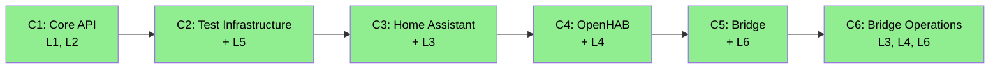

# ARC42STORIES.MD Update — Chapter 6: Bridge Operations

**Issue:** #36
**Date:** 2026-06-27
**Source material:** `2026-06-25-bridge-ops-and-audit-design.md` (spec for #32/#33/#34), `bridge/DEPLOYMENT.md`, blog entries mdp01–mdp05

---

## Overview

Update ARC42STORIES.MD to reflect the bridge operations milestone (#32, #33, #34) as Chapter 6. Three operational capabilities — Docker deployment, provider auto-discovery, and bridge audit events — plus two cross-cutting changes (tenancyId consolidation, programmatic REST clients).

**Also corrects:** C5 Bridge layer entry states "6 record variants" for BridgeMessage — actual code has 7 (ReplayedStateChange was added post-C5 spec). §9.1 flowchart styles C3/C4 as gray despite being ✅ complete. §9.3 chapter sequence denominators updated from "of 5" to "of 6".

---

## Section Changes

### §4 Solution Strategy — Layer Taxonomy

Update L6 Character column. Exact replacement text:

Before:
> Two-sided tunnel: local agent (event relay, filter chain) + cloud-side BridgeDeviceProvider.

After:
> Two-sided tunnel: local agent (event relay, CDI-discovered filter chain) + cloud-side BridgeDeviceProvider. Docker deployment (multi-arch image, Compose). Conditional provider activation via @LookupIfProperty. BridgeAuditEvent CDI events for operational + compliance audit trails.

### §4 Solution Strategy — Chapter Sequencing Rationale

Add C6 entry to the existing §4 sequencing rationale (which currently stops at C5):

- C6 after C5: Bridge Operations requires working bridge infrastructure (hard — Docker image builds from bridge module, audit fires from bridge-server endpoints)

### §6 Runtime View — Two New Scenarios

**Scenario 6 — Provider Auto-Discovery (mDNS/SSDP)**

Sequence: provider enabled → first `discover()` or `status()` call triggers lazy init → config URL present? → if yes, use it → if no, mDNS/SSDP discovery → programmatic RestClientBuilder with resolved URL → connect.

Participants: Provider lazy init (double-checked locking in `getRestClient()` / `ensureSseConnected()`), ConfigMapping (`Optional<String> url`), Discovery class (JmDNS / raw SSDP), RestClientBuilder.

Note: The implementation spec (#32/#33/#34) prescribed `@PostConstruct` for discovery, but the implementation chose lazy init on first use. Both providers have empty `@PostConstruct` methods — discovery and REST client creation happen in `getRestClient()` (HA) and `ensureSseConnected()` (OH) via double-checked locking. This avoids startup races with test servers and defers network I/O until the provider is actually used.

**Scenario 7 — Bridge Audit Event Flow**

Sequence: BridgeWebSocketEndpoint receives message → constructs BridgeAuditEvent → Event.fireAsync() → LoggingBridgeAuditObserver (structured JSON log). Shows extensibility: future compliance observer fires independently.

Firing points: @OnOpen (AGENT_CONNECTED), @OnClose (AGENT_DISCONNECTED), @OnTextMessage (5 message types), BridgeDeviceProvider.dispatch() (COMMAND_SENT).

### §7 Deployment View — Mode 3 Rewrite + Docker Deployment

**Rewrite Mode 3 (Hybrid) first — complete replacement of existing content:**

The existing Mode 3 text shows `local-automations`/`cloud-automations` config properties and describes "Bridge runs Drools locally." These were superseded by the CDI classpath extension model (documented in C5 Bridge layer entry). Replace the entire Mode 3 section:

Before (to delete):
```
Bridge runs Drools locally for latency-sensitive reactions. StateChangeEvents also forwarded to cloud...
casehub.iot.bridge.local-automations=security-alert,presence-lights
casehub.iot.bridge.cloud-automations=energy-optimization,morning-routine
```

After (replacement):
> Latency-sensitive observers (Drools rules, YAML triggers) are added to the bridge deployment as classpath dependencies — standard Quarkus CDI extension. They fire locally via `@ObservesAsync StateChangeEvent` on the bridge's own CDI container. The bridge still forwards all events to cloud for orchestration, HITL, ledger, and memory. No bridge-specific configuration — "hybrid" is a deployment topology choice, not a bridge mode.

**Add after Mode 3 (after the three deployment topologies read as a continuous sequence):**

**Docker Deployment:**
- Image: `ghcr.io/casehubio/iot-bridge` (eclipse-temurin:21-jre-alpine, fast-jar, non-root UID 1001)
- Multi-arch: ARM64 + x86_64 via `docker buildx`
- Compose: single service, `network_mode: host` (required for mDNS/SSDP multicast), volume for event store persistence, health check via `/q/health/ready`
- Both HA and OpenHAB provider modules on classpath — each activates independently via `@LookupIfProperty`

**Provider Activation:**
- `@LookupIfProperty(name = "casehub.iot.<provider>.enabled", stringValue = "true")` — disabled provider invisible to `Instance<DeviceProvider>`
- All config properties `Optional<String>` — prevents SmallRye startup validation failure when provider disabled

### §8 Crosscutting Concepts — Four New Subsections

**Provider Activation Pattern:**
`@LookupIfProperty` + `Optional<String>` config. When `enabled` is absent or not equal to `"true"`, the provider bean is not instantiated — no lazy init triggered, no REST client creation, no guard code. All consumption through `Instance<DeviceProvider>`.

**TenancyId Consolidation:**
Single `casehub.iot.tenancy-id` root property replacing three per-module `tenancyId()` properties on `BridgeAgentConfig`, `HomeAssistantConfig`, `OpenHabConfig`. One env var, zero divergence risk.

**Programmatic REST Client Creation:**
`RestClientBuilder` replacing `@RegisterRestClient` property expressions. Root cause: SmallRye resolves `${...}` at config startup — before CDI starts, before `@LookupIfProperty` evaluates. A disabled provider with absent URL crashes the app. Also incompatible with auto-discovery (URL resolved at runtime, after config binding).

**Gotcha:** `ClientHeadersFactory` (MicroProfile REST Client extension interface) is silently ignored by `RestClientBuilder.register()` — it is not a JAX-RS provider. No error, no auth header, 401 on every request. Auth must use `ClientRequestFilter` (a plain JAX-RS provider) instead. Discovered during OpenHAB client migration: `OpenHabAuthHeadersFactory` was deleted and replaced by `OpenHabAuthFilter implements ClientRequestFilter`.

**Bridge Audit Trail (Dual-Trail Pattern):**
`BridgeAuditEvent` CDI event type in `api/bridge/`. `BridgeAuditEventType` enum (8 types, no HEARTBEAT). Operational observer (`LoggingBridgeAuditObserver`) always active. Compliance observer opt-in via classpath — future `casehub-iot-bridge-ledger` module. CDI events support N independent observers; an SPI would select one.

### §9.1 Journey Overview

Update the table row:

| IoT Device Abstraction | From bare scaffold to deployable, tested, multi-platform device integration layer | 6 | Complete |

Fix flowchart — all six chapters green:



### §9.2 Chapter Index

New row:

| 6 | Bridge Operations | IoT Device Abstraction | L3, L4, L6, crosscutting | Low, Low, High | ✅ |

**Layer x Chapter Matrix — new C6 column (bare values, matching existing style):**

| Layer | C6 |
|---|---|
| L1 Device Type System | — |
| L2 SPI & Registry | — |
| L3 Home Assistant | Low |
| L4 OpenHAB | Low |
| L5 Test Harness | — |
| L6 Bridge | High |

**Sequencing rationale:**
- C6 after C5: Bridge Operations requires working bridge infrastructure (hard — Docker image builds from bridge module, audit fires from bridge-server endpoints)

**Update all existing chapter sequence denominators:**
- C1: "Sequence: 1 of 5" → "Sequence: 1 of 6"
- C2: "Sequence: 2 of 5" → "Sequence: 2 of 6"
- C3: "Sequence: 3 of 5" → "Sequence: 3 of 6"
- C4: "Sequence: 4 of 5" → "Sequence: 4 of 6"
- C5: "Sequence: 5 of 5" → "Sequence: 5 of 6"

### §9.3 Chapter Entries — New: Chapter 6

**Chapter 6 — Bridge Operations**

Journey: IoT Device Abstraction | Sequence: 6 of 6 | Status: ✅
Delivered: 2026-06-26 | Issues: #32, #33, #34

What this delivers: Production deployment artifact (Docker Compose + multi-arch image), self-configuring providers (mDNS/SSDP auto-discovery), and observable bridge operations (BridgeAuditEvent CDI events with dual-trail pattern). Cross-cutting: tenancyId consolidated to single root property, REST clients migrated to programmatic creation, all provider config properties made Optional.

**Accountability gaps closed**
- No production deployment artifact → Docker Compose + multi-arch image + deployment guide
- No self-configuration → mDNS/SSDP auto-discovery, URL optional
- No audit trail → BridgeAuditEvent CDI events + LoggingBridgeAuditObserver
- Config divergence risk (3 tenancyId properties) → single casehub.iot.tenancy-id
- Disabled provider crashes app (SmallRye validates required props) → Optional config + @LookupIfProperty
- REST client URL baked at config time (incompatible with discovery) → programmatic RestClientBuilder

Layer impact: L3 Low, L4 Low, L6 High.

### §9.4 Layer Entries — Updates

**Bridge layer:**
- Add issues: #32, #33, #34 alongside existing #5
- Update "What it adds" — Docker deployment, BridgeAuditEvent, @LookupIfProperty provider activation, tenancyId consolidation
- Add key files: BridgeAuditEvent.java, BridgeAuditEventType.java, LoggingBridgeAuditObserver.java, Dockerfile.jvm, docker-compose.yml, DEPLOYMENT.md
- **Correct:** "6 record variants" → "7 record variants" — add ReplayedStateChange to the list and REPLAYED_STATE_CHANGE to the wire format names
- Add architectural decision (inline, not §10): CDI events for bridge audit (not SPI) — dual-trail requires multiple independent observers; CDI selects one SPI implementation but events support N observers
- Add gotcha: SmallRye validates @ConfigMapping properties at startup regardless of bean lifecycle — disabled providers with required properties crash the app. Fix: all properties `Optional<String>`, validated programmatically in lazy init when `enabled=true`

**HA layer:**
- Add issue: #33 alongside existing #3
- Add key files: HomeAssistantDiscovery.java
- Note C6 changes: config properties made `Optional<String>`, `@LookupIfProperty` activation, mDNS discovery via JmDNS, REST client created programmatically via `RestClientBuilder`, tenancyId removed from `HomeAssistantConfig`
- Add gotcha: `@PostConstruct` discovery was planned but implementation uses lazy init (double-checked locking in `getRestClient()`) — avoids startup races with test servers and defers network I/O until provider is actually used

**OH layer:**
- Add issue: #33 alongside existing #4, #11, #13
- Add key files: OpenHabDiscovery.java
- Note C6 changes: same pattern as HA, plus SSDP fallback for discovery
- Add gotcha: same lazy init pattern as HA — `ensureSseConnected()` with double-checked locking replaces planned `@PostConstruct` discovery

### §12 Risks — Updates

**Mitigated:**
- "Bridge security" — now documented in DEPLOYMENT.md: TLS mandatory, bridge-auth-token per tenant, token rotation guidance

**No change to "OpenHAB semantic model assumption"** — auto-discovery (C6) resolves the URL, not the semantic model prerequisite. The semantic model is still a hard prerequisite for Equipment-based discovery. Thing-scoped discovery (C4, #11) is the actual mitigation and is already noted in the existing text.

### §13 Glossary — New Terms

- **BridgeAuditEvent** — Java record fired as a CDI async event for all bridge protocol messages. Carries tenancyId, receivedAt, eventType, optional correlationId/deviceId/message.
- **BridgeAuditEventType** — Enum classifying audit events: STATE_CHANGE, REPLAYED_STATE_CHANGE, STATE_SNAPSHOT, PROVIDER_STATUS_CHANGE, COMMAND_SENT, COMMAND_RESPONSE, AGENT_CONNECTED, AGENT_DISCONNECTED. No HEARTBEAT.
- **@LookupIfProperty** — Quarkus CDI mechanism for conditional bean activation. Provider not discoverable via `Instance<>` when property is absent or not equal to `"true"`.
- **Dual-trail audit pattern** — Operational logging and compliance ledger as independent CDI event observers. Both fire for every BridgeAuditEvent. Neither blocks the other.

---

## Out of Scope

- Blog entries (🔲 markers in layer entries remain — no blog covers C6 yet)
- Filling in 🔲 gotchas/key wiring on C1–C4 layer entries (separate concern)
- Native image Dockerfile (tracked separately)
- BridgeAuditStore SPI (#35 — separate task on this branch)
